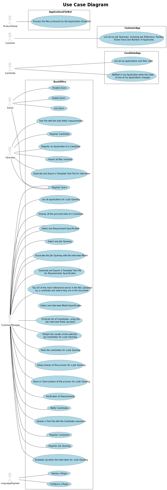

## System Specifications Document

### 1. Introduction

This document outlines the specifications for the development of a comprehensive system to manage user registration, customer management, job openings, candidates, applications, language engineering tasks, and application file processing. The system aims to provide a seamless experience for administrators, operators, customer managers, language engineers, candidates, customers, and product owners.

### 2. Use Cases

#### 2.1 User Management

**Register Users (1000.1):** Allows administrators and operators to register new users into the system.  
**Disable Users (1000.2):** Enables administrators to deactivate user accounts temporarily.  
**Enable Users (1000.3):** Allows administrators to reactivate previously disabled user accounts.  
**List Users (1000.4):** Provides administrators with a list of all registered users in the system.

#### 2.2 Customer Management

**Register Customers (1001):** Enables customer managers to register new customers into the system.
**List all my Job Openings, including Job Reference, Position, Active Since and Number of Applicants (B3002):** Allows customers to view all their job openings along with key details.

#### 2.3 Job Management

**Register Job Opening (1002):** Allows customer managers to create new job openings within the system.  
**List all applications for a Job Opening (1005):** Provides customer managers with a list of all applications received for a specific job opening.  
**Display all the personal data of a Candidate (1006):** Allows customer managers to view the personal data of candidates who have applied for a job opening.  
**Rank the candidates for a Job Opening (B1013):** Enables customer managers to rank candidates based on predefined criteria.  
**Setup phases of the process for a Job Opening (B1010.1):** Allows customer managers to set up different phases of the job application process.  
**Open or Close phases of the process for a Job Opening (B1010.2):** Enables customer managers to open or close different phases of the job application process.  
**Verification of Requirements (B1015):** Allows customer managers to verify if the candidates meet the job requirements.  
**Notify Candidates (B1016):** Enables customer managers to notify candidates about the status of their applications.  
**Upload a Text File with the Candidate responses (B1017):** Allows customer managers to upload text files containing candidate responses.  
**Evaluate (grades) the Interviews for a Job Opening (B1018):** Enables customer managers to evaluate and grade candidate interviews.  
**Ordered list of Candidates, using the Job Interview Points (grades) (B1019):** Provides an ordered list of candidates based on their interview scores.  
**Publish the results of the selection of Candidates for a Job Opening (B1020):** Allows customer managers to publish the selection results of candidates.

#### 2.4 Language Engineering

**Deploy a Plugin (1008.1):** Enables language engineers to deploy and configure an Interview Model.  
**Configure a Plugin (1008.2):** Enables language engineers to deploy and configure a Requirements Specification.  
**Select the Requirements Specification (1009):** Associates the job application with the requirements specification.  
**Select the Interview Model to use (1011):** Associates the job application with the interview model.  
**Generate and Export a Template Text File for Requirements Specification (1012):** Allows customer managers to generate and export template text files to help collect candidate answers during the interviews.  
**Generate and Export a Template Text File for Interviews (2003):** Enables operators to generate and export template text files to help collect data fields for candidates of a job opening.  
**Text File with the data fields (requirements) (B2004):** Allows operators to generate a text file containing the required data fields.

#### 2.5 Candidate Management

**Register Candidate (2000a):** Allows operators to register new candidates into the system.  
**Register an Application of a Candidate (2002.1):** Enables operators to register applications submitted by candidates.  
**Import all files received (2002.2):** Provides operators with the ability to import all files received from candidates as part of their application.  
**List all my applications and their state (B3000):** Allows candidates to view all their applications and their current status.  
**Notified in my Application when the state of one of my applications changes (B3001):** Notifies candidates when the status of any of their applications changes.

### 2.6 Application File Processing

**Process the files produced by the Applications Email Bot (2001):** Allows product owners to process files generated by the Applications Email Bot.  
**Top 20 of the most referenced words in the files uploaded by a candidate and where they are in the document (B4000):** Enables customer managers to analyze the most referenced words in candidate-uploaded documents.

### 3. Use Case Diagram

### 4. System Architecture

The system will be designed using a modular architecture, with distinct components for user management, customer management, job management, language engineering, candidate management, and application file processing.

### 5. Conclusion

This document outlines the specifications for the development of a comprehensive system to manage various aspects of user registration, customer management, job openings, candidates, language engineering tasks, and application file processing. By adhering to these specifications, the system will be able to meet the needs of its users and provide a seamless experience across all functionalities.