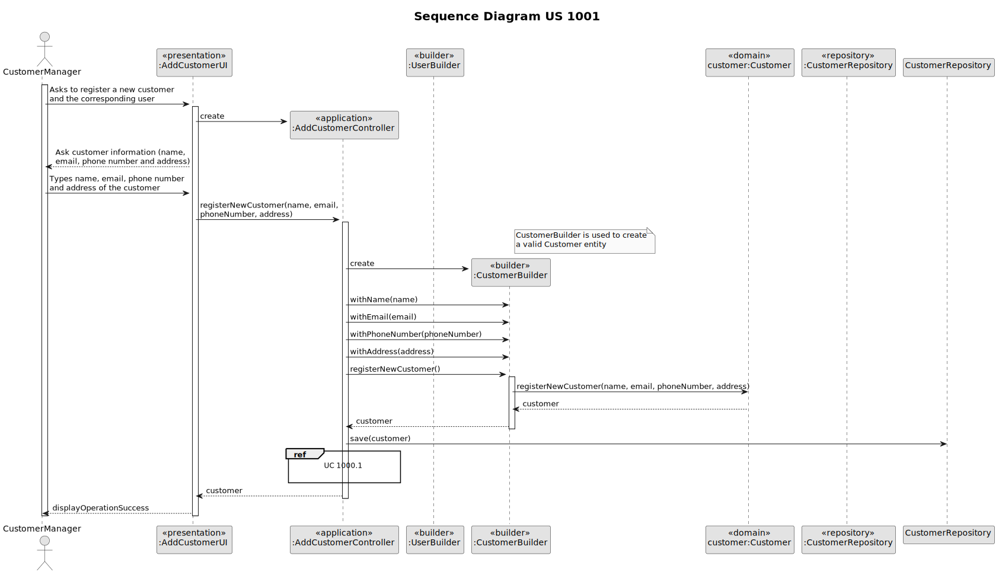
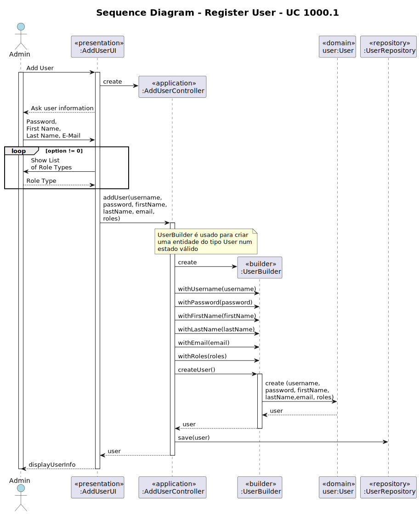

# US 1001 - As Customer Manager I want to register a customer and that the system automatically creates a user for that customer.

## 1. Context

### 1.1. Customer Specifications and Clarifications

* Question 19: "Na criação de um utilizador no sistema o nome é definido pelo utilizador ou é o nome da pessoa (primeiro e último) 
e se a password é definida pelo utilizador ou gerada pelo sistema?"
  * Answer: "No âmbito da US 2000a o Operator cria utilizadores do sistema para candidatos que ainda não estejam no sistema. 
  Tem de fazer isso com base nos dados recebidos na candidatura (que incluem email e nome). O email servirá para identificar 
  a pessoa. Neste contexto é necessário ter uma password para esse novo utilizador. Uma vez que essa informação não é 
  transmitida pelo candidato, suponho que a solução mais “aconselhada” será o sistema gerar uma password para esse utilizador. 
  Como o utilizador/candidato irá receber essa informação (a forma de autenticação na app) está out of scope, no sentido
  em que não existe nenhuma US que remete para isso. As US 1000 e 1001 também remetem para criação de utilizadores. 
  Aqui, eventualmente poderia-se pensar em introduzir manualmente as passwords, mas pode ser pelo mesmo mecanismo de
  definição automática de password, descrito anteriormente. Relativamente ao nome ver novamente a Q11."


* Question 104: "A criação de uma conta para o customer é feita ao inserir manualmente o email e nome do customer ou é expectavel 
ter uma lista de customers não registados no sistema para usar?"
  * Answer: "Não percebi bem o conceito de customers não registados. Penso que esse conceito não existe. A US 1001 indica que se 
  pretende registar um customer. Ao registar-se o customer deve-se também criar um utilizador para que o customer possa aceder 
  à App de customers."


* Question 111: "Regras de negócio para endereço do customer - Quais são as regras de negócio do endereço do customer?"
  * Answer: "(Nota: evitem fazer perguntas muito genéricas e técnicas). Se me perguntar se é suficiente, nesta fase, que o 
  sistema aceite apenas endereços nacionais, a minha resposta é afirmativa. Se a pergunta era outra, por favor coloque de novo, 
  desta vez como se estivesse a falar com alguém que não sabe o que são regras de negócio, mas é especialista no negócio"


* Question 112: "É correto assumir que o customer fica automaticamente atribuido ao customer manager que o registou?"
  * Answer: "Sim. No âmbito deste projeto vamos assumir que isso deve acontecer."


* Question 118: "Endereço de Customer - Relativamente a um Customer(empresa), foi dito que uma informação a recolher seria o 
endereço(postal, não de email) relativamente a um job opening, a dúvida é se uma empresa que tenha vários polos em sítios 
diferentes, teria então vários endereços, ou seria melhor considerar cada um desses polos um Customer individual? No entanto, 
se fosse para considerar cada um desses polos um Customer individual, o email(como identificador) teria de ser igual, ou seria 
possível ter um email diferente para cada polo da empresa?"
  * Answer: "Deve considerar que a empresa (Customer) tem um morada (principal) que é a que está associada ao seu registo. 
  No contente de um job opening a morada que “aparece” nessa oferta de emprego é a morada associada a esse emprego, que 
  pode ser de outro local da empresa."


* Question 122: "E-mail atribuído ao Customer- Na US 1001 é pedido que a criação de um User através da CustomerEntity criada 
seja automática. Contudo, para a criação de um User é necessário um e-mail. Permite que seja pedido um e-mail ao Manager, para 
ficar associado á entidade? A password já será gerada automaticamente, por isso seria também possível a geração automática de um e-mail."
  * Answer: "Para essa US faze sentido assumir que o Customer Manager conhece o email a ser suado para esse Customer e pode introduzi-lo. 
  Tal como para outras situações similares podem assumir que a password é gerada pelo sistema e que existe uam forma do utilizador 
  conhecer essa password, mas que está forá do âmbito actual do sistema. Não percebi à referência a CustomerEntity. O que é?

## 1.2. Explanation

* It involves a new feature request to enable Customer Managers to register customers and then the system automatically creates the corresponding user for that customer.
* This task has not been assigned or completed in previous sprints; It's a new addition to enhance the functionality of the system.
* There are no bugs related to this task; It's a new feature implementation.

## 2. Requirements

**US 1001** : As a Customer Manager, I want to register a customer and that the system automatically creates a user for that customer.

#### Use Cases:

* This User Story will encompass the following use cases:
  * UC 1000.1: Register User
  * UC 1001: Register Customer

According to the data present in the specifications document, [Specifications_Doocument.md](..%2F..%2FGeneral%20Documentation%2FUse%20Case%20Diagram%2FSpecifications_Doocument.md).

#### Functionality:

* The task aims to enable Customer Managers to register customers and then the system automatically creates the corresponding user for that customer

#### Understandability:

* Customer Managers, as part of their responsibilities, need the capability to directly register customers in the system. This includes creating a user for the customer, which is a necessary step for the customer to access the system, as well as collecting and storing customer information into the system. These profiles will save as basis for future USs.

#### Dependencies:

* No direct dependencies identified. However, the task might relate to the overall system architecture and user management
  functionalities defined in previous user stories.

#### Acceptance Criteria:

- US 1001.1: Upon registration, the system shall automatically create a user profile for the customer.
- US 1001.2: The user profile shall be associated with Job Openings and other relevant entities in the system.
- US 1001.3: The system should automatically generate a unique password for the new user profile (customer). The generated password should follow defined security policies, such as having a minimum of 8 characters, including both uppercase and lowercase letters, digits, and at least one non-alphanumeric character. (Question 54)
- US 1001.4.: The system should perform appropriate validations on the data provided during candidate registration. This
  includes checking if mandatory fields are filled and if data formats (such as email address and phone number) are valid.

#### Input and Output Data

*Input Data:*

* Typed Data:
  * Name of the Customer;
  * Email of the Customer;
  * Phone Number of the Customer;
  * Address of the Customer;

*Output Data:*
  * (In)Success of the operation


## 3. Analysis

* Use Case 1000.1: The creation of a new user is out of scope for the project's domain. Therefore, this aspect is not
represented in the domain model.

* Use Case 1001: Our domain model satisfies the requirements of the aforementioned use cases, as when creating a
customer, we will instantiate the customer aggregate, thus interacting solely with that aggregate.

* See the Domain Model in: [domain_model_v4.puml](..%2F..%2FGeneral%20Documentation%2FDomain%20Model%2Fdomain_model_v4.puml)

## 4. Design

### 4.1. Realization

#### Sequence Diagram 



**UC 1001.1**



#### Class Diagram

For UC 1001, the decision to omit a separate class diagram from the documentation is based on the principle of Domain-Driven Design (DDD).
Duplicating class information from the Domain Model would introduce redundancy. By directly utilizing the Domain Model, clarity and
efficiency are maintained in the documentation process while ensuring aligment with the project's evolving domain understanding.

Regarding UC 1000.1, it is advisable to refer to the Class Diagram specific to that Use Case [classdiagram_registeruser_uc1000.1.puml](..%2F..%2FGeneral%20Documentation%2FGenerics%20Diagrams%2Fclassdiagram_registeruser_uc1000.1.puml).

### 4.2. Applied Patterns

#### Builder Pattern

We use the Builder pattern for creating a customer because:

1. The Builder pattern allows us to separate the construction logic of a complex object from its representation. This
   means that the CustomerBuilder class is responsible for building a Customer object.
2. With the Customer Builder, we can define clear and concise methods for configuring Customer attributes such as name,
   email, phone number and address. This makes building the Customer more readable and easier to understand.
3. The Customer Builder can include validation logic to ensure that the data provided to create a Customer is valid.
   For example, we can check if the provided email has a valid format or if the phone number contains only digits.
4. If the logic for creating a Customer becomes more complex in the future, we can handle that complexity within the
   Customer Builder while keeping the interface simple for its users.

#### Factory Pattern

The Factory pattern is employed in our system to facilitate the creation of repository instances, ensuring a flexible
and centralized approach to object creation. Here's why we utilize the Factory pattern:

1. The Factory pattern allows us to encapsulate the logic for creating complex objects, such as repositories, within
   dedicated factory classes.
2. By using a Factory, we abstract the process of object creation behind a common interface. This means that client code
   interacting with the factory doesn't need to know the specifics of how objects are created; it simply requests an object
   from the factory and receives the appropriate instance.
3. The Factory pattern offers flexibility in object creation by allowing different implementations of the factory to be
   used interchangeably. For example, we can have different factory implementations for in-memory storage and database-backed
   storage, and switch between them seamlessly based on our requirements.

#### DAO (Data Access Object) Pattern

The DAO (Data Access Object) pattern is used to encapsulate data access, providing an abstract interface to interact with
the database or any other data source. In our implementation, the DAO pattern can be identified in the CustomerRepository class.

1. The DAO pattern encapsulates data access operations such as saving, updating, retrieving, and deleting records. This
   allows database operations to be centralized in a single class, facilitating maintenance and reducing code duplication.
2. The DAO provides an abstract interface to interact with the data source, allowing the rest of the application to be
   independent of the specific database implementation.

#### Repository Pattern

We utilize the Repository pattern for managing customer data because:

1. The pattern abstracts away the complexities of database interactions, allowing us to focus on business logic without
   directly dealing with database specifics.
2. The CustomerRepository Interface provides a standardized way to perform Create, Read, Update and Delete operations on
   customer entities. This uniform interface simplifies data access throughout the application.
3. Implementations like CustomerJpaRepository and InMemoryCustomerRepository handle specific data store interactions.

### 4.3. Tests

**Test 1:** Verifies that it is not possible to insert numbers in the name. (AC 1001.4)

````
    @Test
    void withNameInvalidInput() {
        CustomerBuilder builder = new CustomerBuilder();

        assertThrows(IllegalArgumentException.class, () -> builder.withName("John123 Doe")); // Check if it throws exception for invalid first name
    }
````

**Test 2:** Verifies that only email inserts in the correct format (e.g., example@example.com) are accepted. (AC 1001.4)

````
    @Test
    void withEmailInvalidInput() {
        CustomerBuilder builder = new CustomerBuilder();

        assertThrows(IllegalArgumentException.class, () -> builder.withEmail("john@example")); // Check if it throws exception for invalid email
    }
````

**Test 3:** Verifies that it is not possible to insert letters in the phone number, and it must contain 9 digits. (AC 1001.4)

````
    @Test
    void withPhoneNumberInvalidInput() {
        CustomerBuilder builder = new CustomerBuilder();

        assertThrows(IllegalArgumentException.class, () -> builder.withPhoneNumber("12345678")); // Check if it throws exception for invalid phone number
    }
````

**Test 4:** Verifies that an instance of Customer was effectively created with the correct values entered. (AC 1001.1)

````
    @Test
    void build() {
        String name = "John";
        String email = "john@example.com";
        String phoneNumber = "123456789";
        String address = "1234 Main St";

        CustomerBuilder builder = new CustomerBuilder();
        Customer customer = builder.withName(name)
                .withEmail(email)
                .withPhoneNumber(phoneNumber)
                .withAddress(address)
                .build();

        assertEquals(name, customer.getName()); // Check if name is set correctly
        assertEquals(email, customer.getEmail()); // Check if email is set correctly
        assertEquals(phoneNumber, customer.getPhoneNumber()); // Check if phone number is set correctly
        assertEquals(address, customer.getAddress()); // Check if address is set correctly
    }
````

## 5. Implementation

In order to immediately test if a customer has been successfully registered, we created a method that fills a file.txt
with the entered email and the password generated by the Password Generator class. This allows us to check if we can log
in with these credentials. If these credentials are accepted during login, then the customer was created successfully.

### Main classes created

1. `Customer`: Represents a customer and stores information such as their name, email, phone number and address

2. `CustomerBuilder`: Facilitates the creation of instances of the Customer class, validating the provided data
   during construction.

3. `PasswordGenerator`: Generates random passwords with strong security, ensuring the inclusion of at least one uppercase
   letter, one digit, and one non-alphanumeric character.

4. `CustomerRepository`: Interface that defines methods for persistence operations related to customer, such as
   saving and finding customers by email.

5. `AddCustomerController`: Coordinates the business logic for adding a new customer, utilizing the CustomerBuilder
   and the CustomerRepository.

6. `AddCustomerUI`: User interface responsible for interaction to add a new customer, invoking the AddCustomerController
   for processing.

## 6. Integration/Demonstration

This functionality will be crucial for the problem domain as the customer will be one of the main users of this application.

To execute this functionality, we need to run the script `build-all`, `run-bootstrap` (to load the actors responsible for
registering a customer, in this case, the customer managers), and finally `run-backoffice` to execute the user interface. Next,
we should log in with the credentials of an customer manager, for example, manager1 (Username) and managerA1 (Password), and
choose the "Settings" option, then select the first option (Register a customer). Finally, we just have to fill in the
various fields that will be requested, and a success message will be displayed.

## 7. Observations

We conclude that implementing the customer registration and user profile creation functionality is crucial for system
efficiency. Integrating design patterns and continuous feedback ensured a robust, adaptable solution, aiming to enhance
the customer manager experience and ensure data security.
