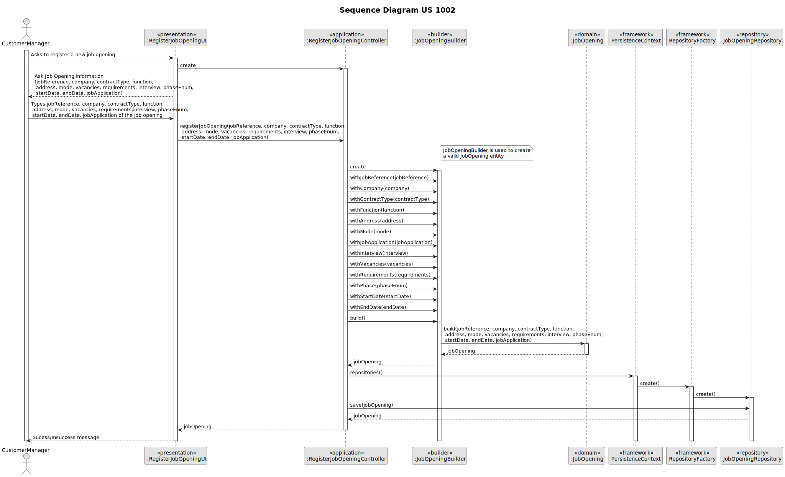

# US 1002 - As Customer Manager, I want to register a job opening.

## 1. Context
### 1.1. User Story Description

As Customer Manager, I want to register a job opening.

### 1.2. Customer Specifications and Clarifications


* Question: "No contexto em que o Customer Manager regista uma oferta de
  emprego, como são selecionados/definidos os requisitos para essa job offer?"
    * Answer: "O Customer manager regista a job opening (US 1002) e de seguida (normalmente)
      seleciona qual o requirements specification que é adequado a esse job opening. O
      requirements specification será um dos que foi “criado” pelo language engineer e
      registado no sistema."

* Question: " No job opening é tudo de preenchimento obrigatório ou
  existem opcionais?"
    * Answer: "Os campos referidos na secção 2.2.2 são de preenchimento obrigatório. Os
      requirements vão ser dinâmicos uma vez que dependem do requirements specification
      selecionado para aquele job opening (que se baseia numa linguagem)."

* Question: "Sobre a job specification, deve ser o cliente a enviar os
  requisitos ou é a responsabilidade do customer manager? Qual o conceito de
  uma job specification?"
    * Answer: "Tipicamente será o customer que informa o custerm
      manager dos requisitos mínimos para uma oferta de emprego. O Customer manager
      verifica se existe já um requirements specification adequado. Caso não existe, com a
      ajuda do Language Engineer é criado um novo."

* Question: "No job opening (secção 2.2.2), no campo company, deve ser o
  customer name ou o customer code, uma vez que o customer code é único e
  introduzido manualmente?"
    * Answer: "A informação relativa ao job opening que aparece no final da página 5 deve ser vista
      como algo a ser usado na divulgação de uma oferta de emprego. Nesse contexto, para a
      Company faz mais sentido divulgar o nome da company e não o seu código. Dito isto, em
      termos de armazenamento numa base de dados poderá ficar o código."

## 2. Requirements


**US 1002** As Customer Manager, I want to register a job opening.

#### Functionality:

* The task aims to register a job opening in the system. This includes defining the job reference and other relevant
  information that will be used to manage the recruitment process for that specific job.

#### Understanding:

* Customer managers, as part of their responsibilities, needs to register job openings in the system. This task is
  essential to start the recruitment process for a specific job. The job opening registration should include all relevant
  information that will be used to manage the recruitment process for that specific job.

#### Dependencies:

* No direct dependencies identified. However, the job opening registration task is expected to be part of a broader
  recruitment process, which may include other tasks such as candidate registration, job application management, and
  others.

#### Acceptance Criteria:

- US 1002 - AC 1: The system shall allow the Customer Manager to register a job opening.
- US 1002 - AC 2: The job opening registration shall include the following information:
    - Job Reference;
    - Company;
    - Contract Type;
    - Function;
    - Mode;
    - Vacancies;
    - Requirements;
    - Phase;
    - Results;
    - Start Date;
    - End Date;
    - Number of Applications;
    - Address;


#### Input and Output Data

*Input Data:*

* Typed data:
    * Job Reference
    * Company
    * Function
    * Vacancies
    * Requirements
    * Phase
    * Start Date
    * End Date
    * Address
  
* Selected data:
    * Contract Type
    * Mode

*Output Data:*
    * (In)Success of the operation

#### Use Cases:

* This user story will encompass use cases 1012 according to the data present in the specifications document
  ([Specifications_Document.md](..%2F..%2FGeneral%20Documentation%2FUse%20Case%20Diagram%2FSpecifications_Document.md))).

## 3. Analysis

*Check Analysis.txt on analysis folder*

-> FROM SPECIFICATION:

• 1002 As Customer Manager, I want to register a job opening. – Priority: 1
– References: Alternatively this can be achieved by a bootstrap process


-> Bussiness Rules:

Job openings (or job vacancies) are created in the system by a customer manager. A job opening includes:

• Job Reference A unique identifier of the job opening (generated by the system, for instance based on the customer code followed by a sequential number)
• Title or function Such as "front end programmer"
• Contract Type Such as full-time or part-time
• Mode Such as remote, hybrid, onsite
• Address Address for job
• Company Customer name
• Number of vacancies
• Description
• Requirements

Requirement Specifications and Interview Models:

Job vacancies (job openings) must include a Job Requirement Specification. This represents a set of application requirements that the applicants must achieve. For instance, we could de- fine a job requirement specification named "front end junior programmer", were candidates must have at least 2 years of experience, a degree in computer science or similar program, and knowledge in, at least, one of the following programming languages: java, javascript, type- script. Usually this information can be collected from the curriculum vitae of the candidate.
Interviews are a very important tool for the evaluation of candidates. Interviews should be based on a set of pre-defined questions. Interview Models, as the name implies, are sequences of questions that can be used to register the answers of candidates during interviews.
Both job requirement specifications and interview models follow the same usage. A software engineer, with great competences in language engineering, following directions from customer
managers, designs and implements modules that are dynamically added to the system. These modules contain the implementation of job requirements specification or interview models. These modules should be able to implement the necessary functionalities from processing job requirements or interviews.

A job requirement specification module should:

• Generate a template text file with the requirements to be evaluated and the possible answers for each requirement
• Evaluate if a text file with the requirements for a particular candidate is syntactically correct
• Evaluate a text file with the requirements for a particular candidate and provide the result, approved or rejected, and in case of rejection, include justification

An interview model module should:

• Generate a template text file with the questions to be asked in the interview and the possible answers for each question
• Evaluateifatextfilewiththequestionsandanswersforaparticularcandidateinterview is syntactically correct
• Evaluate a text file with the questions and answers for a particular candidate interview and provide a numeric grade for that interview
.
Figure 2.2 illustrates an example of a template text file with requirements for a job opening. In this example, the evaluation of this requirements (with the existing values) could result in a rejection since the candidate has no degree. The system should provide a justification, such as "A minimum Bachelor degree is required for the job position.". A similar approach is used for job interviews, but in this case, the goal is not to approve or reject a candidate but to evaluate the answers and calculate a grade for the interview in the range 1-100.
A job interview is a form with a set of questions. Each question as a value associated. The sum of the values for all the questions should be 100. At least the following type of questions should be supported:


• True/False A question with only a true or false answer.
• ShortTextAnswer A question with a short text answer.The limit of the answer should be the specified by a regular expression.
• Choice, with Single-Answer A question with a set of choices where only one can be selected
• Choice, with Multiple-Answer A question with a set of choices where many can be selected
• Integer Number A question which answer is an integer number
• Decimal Number A question which answer is a decimal number
• Date A question which answer is a date
• Time A question which answer is a time
• Numeric Scale A question which answer is one option in a range of integers (ex: 1-5)
According to the answers given in the interview for each question the value of the question is calculate following evaluation rules. For instance, consider the following question, which value is 10:
What programing language should be used for system XPTO?
1. Java
2. C#
3. PHP
4. Javascript
5. Typescript
   For this case one could define the following rules used in the evaluation of the grade for the question:
1. If the answer is 4 and 5 then 100%
2. if the answer is 4 then 40%
3. if the answer is 5 then 80%
   In this case, if the answer is 1 and 2 the grade is 0% of 10, therefore 0. If the answer is 4, the grade is 40% of 10, therefore 4. The total grade of an interview is the sum of the grade of all the questions.

## 4. Design

### 4.1. System Diagram




### 4.2. Applied Patterns

#### Builder Pattern

We use the Builder pattern for creating a customer because:

1. The Builder pattern allows us to separate the construction logic of a complex object from its representation. This
   means that the JobOpeningBuilder class is responsible for building a JobOpening object.
2. With the JobOpeningBuilder, we can define clear and concise methods for configuring JobOpening attributes. This makes building the JobOpening more readable and easier to understand.
3. The JobOpeningBuilder can include validation logic to ensure that the data provided to create a JobOpening is valid.
4. If the logic for creating a JobOpening becomes more complex in the future, we can handle that complexity within the
   JobOpeningBuilder while keeping the interface simple for its users.

#### Factory Pattern

The Factory pattern is employed in our system to facilitate the creation of repository instances, ensuring a flexible
and centralized approach to object creation. Here's why we utilize the Factory pattern:

1. The Factory pattern allows us to encapsulate the logic for creating complex objects, such as repositories, within
   dedicated factory classes.
2. By using a Factory, we abstract the process of object creation behind a common interface. This means that client code
   interacting with the factory doesn't need to know the specifics of how objects are created; it simply requests an object
   from the factory and receives the appropriate instance.
3. The Factory pattern offers flexibility in object creation by allowing different implementations of the factory to be
   used interchangeably. For example, we can have different factory implementations for in-memory storage and database-backed
   storage, and switch between them seamlessly based on our requirements.

#### DAO (Data Access Object) Pattern

The DAO (Data Access Object) pattern is used to encapsulate data access, providing an abstract interface to interact with
the database or any other data source. In our implementation, the DAO pattern can be identified in the JobOpeningRepository class.

1. The DAO pattern encapsulates data access operations such as saving, updating, retrieving, and deleting records. This
   allows database operations to be centralized in a single class, facilitating maintenance and reducing code duplication.
2. The DAO provides an abstract interface to interact with the data source, allowing the rest of the application to be
   independent of the specific database implementation.

#### Repository Pattern

We utilize the Repository pattern for managing customer data because:

1. The pattern abstracts away the complexities of database interactions, allowing us to focus on business logic without
   directly dealing with database specifics.
2. The JobOpeningRepository Interface provides a standardized way to perform Create, Read, Update and Delete operations on
   customer entities. This uniform interface simplifies data access throughout the application.
3. Implementations like JobOpeningJpaRepository and InMemoryJobOpeningRepository handle specific data store interactions.


### 4.3. Tests
*Check the test plan on design folder*
*Check tests on maven tests folder*
```
@BeforeEach
    public void setUp() {
        // Arrange
        String jobReference = "ABC123";
        String address = "123 Main St";
        String company = "ACME Inc.";
        String contractType = "Full-time";
        String function = "Software Engineer";
        String mode = "Remote";
        String vacancies = "2";
        String requirements = "Java proficiency";
        String phase = "Interview";
        Date startDate = Date.valueOf("2024-06-01");
        Date endDate = Date.valueOf("2024-07-01");

        jobOpening1 = new JobOpeningBuilder()
                .withJobReference(Designation.valueOf(jobReference))
                .withAddress(address)
                .withCompany(company)
                .withContractType(contractType)
                .withFunction(function)
                .withMode(mode)
                .withVacancies(vacancies)
                .withRequirements(requirements)
                .withPhase(phase)
                .withStartDate(startDate)
                .withEndDate(endDate)
                .build();

        jobOpening2 = new JobOpeningBuilder()
                .withJobReference(Designation.valueOf(jobReference))
                .withAddress(address)
                .withCompany(company)
                .withContractType(contractType)
                .withFunction(function)
                .withMode(mode)
                .withVacancies(vacancies)
                .withRequirements(requirements)
                .withPhase(phase)
                .withStartDate(startDate)
                .withEndDate(endDate)
                .build();
    }

````

````
 @Test
    public void ensureJobOpeningsAreEqualForTheSameJobReference() {
        // Act
        boolean result = jobOpening1.equals(jobOpening2);

        // Assert
        assertTrue(result);
    }
````

````
@Test
    public void ensureJobOpeningsAreNotEqualForDifferentJobReferences() {
        // Arrange
        String jobReference2 = "XYZ789";

        jobOpening2 = new JobOpeningBuilder()
                .withJobReference(Designation.valueOf(jobReference2))
                .withAddress(jobOpening2.toDTO().getAddress())
                .withCompany(jobOpening2.toDTO().getCompany())
                .withContractType(jobOpening2.toDTO().getContractType())
                .withFunction(jobOpening2.toDTO().getFunction())
                .withMode(jobOpening2.toDTO().getMode())
                .withVacancies(jobOpening2.toDTO().getVacancies())
                .withRequirements(jobOpening2.toDTO().getRequirements())
                .withPhase(jobOpening2.toDTO().getPhase())
                .withStartDate(jobOpening2.toDTO().getStartDate())
                .withEndDate(jobOpening2.toDTO().getEndDate())
                .build();

        // Act
        boolean result = jobOpening1.equals(jobOpening2);

        // Assert
        assertFalse(result);
    }
````

````
@Test
    public void ensureJobOpeningsAreNotEqualForDifferentClasses() {
        // Act
        boolean result = jobOpening1.equals("not a JobOpening object");

        // Assert
        assertFalse(result);
    }
    
````

````
    @Test
    public void ensureJobOpeningsAreTheSameAsTheirInstance() {
        // Act
        boolean result = jobOpening1.sameAs(jobOpening1);

        // Assert
        assertTrue(result);
    }
````

````
    @Test
    public void ensureJobOpeningsAreNotTheSameForDifferentJobReferences() {

        JobOpening jobOpening3;

        String jobReference = "ABC345";
        String address = "123 Main St";
        String company = "ACME Inc.";
        String contractType = "Full-time";
        String function = "Software Engineer";
        String mode = "Remote";
        String vacancies = "2";
        String requirements = "Java proficiency";
        String phase = "Interview";
        Date startDate = Date.valueOf("2024-06-01");
        Date endDate = Date.valueOf("2024-07-01");

        jobOpening3 = new JobOpeningBuilder()
                .withJobReference(Designation.valueOf(jobReference))
                .withAddress(address)
                .withCompany(company)
                .withContractType(contractType)
                .withFunction(function)
                .withMode(mode)
                .withVacancies(vacancies)
                .withRequirements(requirements)
                .withPhase(phase)
                .withStartDate(startDate)
                .withEndDate(endDate)
                .build();

        // Act
        boolean result = jobOpening1.sameAs(jobOpening3);

        // Assert
        assertFalse(result);
    }
````


## 5. Implementation

### Main classes created

1. `JobOpening`: Represents a customer and stores information such as their designation, function and address.

2. `JobOpeningBuilder`: Facilitates the creation of instances of the JobOpening class, validating the provided data
   during construction.

3. `JobOpeningRepository`: Interface that defines methods for persistence operations related to job opening, such as
   saving and finding job openings.

4. `JobOpeningDto`: Data Transfer Object that represents the JobOpening class.

5. `RegisterJobOpeningController`: Coordinates the business logic for adding a new job opening, utilizing the JobOpeningBuilder
   and the JobOpeningRepository.

6. `RegisterJobOpeningUI`: User interface responsible for interaction to add a new customer, invoking the RegisterJobOpeningController
   for processing.

## 6. Integration/Demonstration

This functionality will be crucial for the problem domain as the job opening will be one of the main users of this application.

To execute this functionality, we need to run the script `build-all`, `run-bootstrap` (to load the actors responsible for
registering a customer, in this case, the customer managers), and finally `run-backoffice` to execute the user interface. Next,
we should log in with the credentials of an customer manager, for example, manager1 (Username) and managerA1 (Password), and
choose the "Settings" option, then select the option (Register a job opening). Finally, we just have to fill in the
various fields that will be requested, and a success message will be displayed.

## 7. Observations

N/A