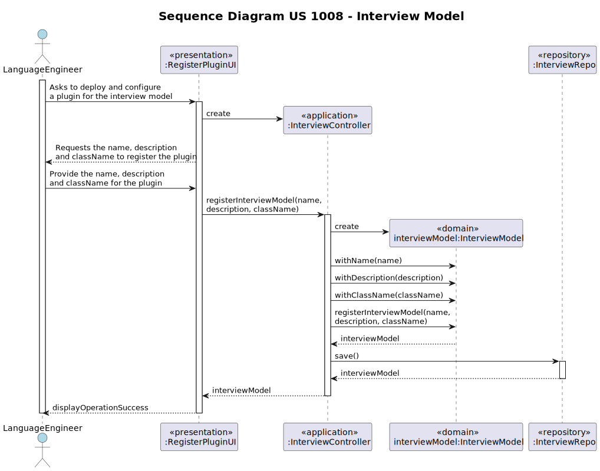
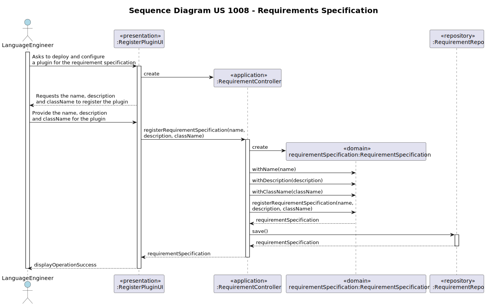

# US 1008 - As Language Engineer, I want to deploy and configure a plugin (i.e., Job Requirement Specification or Interview Model) to be used by the system.

## 1. Context

### 1.1. Customer Specifications and Clarifications

* Question 41: "Como é que o Language Engineer faz o interview model e os job requirements? É texto? Ou ele seleciona perguntas 
para a interview e requirements para a job opening? E isso é quando se está a criar uma entrevista ou uma job opening ou 
para-se a meio para fazer isso e depois continua se?"
    * Answer 41: "O language enginner com informação passada pelo customer manager (que obteve do customer) vai desenvolver em 
  java um jar correspondente ao modulo/plugin. Para esse desenvolvimento terá de utilizar técnicas de desenvolvimento de 
  gramáticas/linguagens como o antlr. Esse código ficará num jar que depois o language engineer “instala/regista” na aplicação 
  (US1008, por exemplo, associando um nome ao jar num ficheiro de configuração – “5 anos experiencia java”, “req-model-5-years-java.jar”). 
  A aplicação com essa informação carrega dinamicamente esse jar. Na gramátca usada no jar é que vão estar espelhadas a estrutura das 
  perguntas a usar nesse modelo e sua avaliação. Estas atividades têm de ser feitas antes de se poder fazer a US1008. Esse trabalho é 
  feito “fora” dos sistema, apenas se registando o modelo (quando está pronto) na US1008. A US 1009 e US1011 permitem selecionar
  modelos a usar (dos que foram devidamente registados no sistema)."

* Question 47: "Relativamente aos módulos das entrevistas e dos requisitos, os seus identificadores podem ser automáticos ou específicos 
(i.e., manuais)?"
    * Answer 47: "A Q41 refere a mesma US. Lá refere-se que cada modulo será registado no sistema através de 2 dados, por exemplo, 
  associando um nome ao jar num ficheiro de configuração – “5 anos experiencia java”,  “req-model-5-years-java.jar”. Ou seja, 
  assume-se que cada modulo terá um nome/designação (que suponho que deverá ser única) e a este nome ficará associado o nome do 
  ficheiro jar (provavelmente um path completo) que implementa esse módulo. Ou seja, esse nome/designação pode ser considerado 
  como um identificador especifico/manual."

* Question 88: US1002 – Quando o Customer Manager regista uma job offer, é ele que cria as requirement specifications e 
as interview models ou é-lhe dada uma lista destes para ele selecionar?
    * Answer 88: Existe a US1002 e as US1009 e US1011. Penso que está claro qual a responsabilidade de cada uma. A 
  criação dos modelos das entrevistas e dos requisitos é um caso de uso especifico e com um US especifica para registar 
  no sistema os respectivos plugins (US1008).

* Question 121: "Perguntas para os plugins.- É possível esclarecer-nos se as perguntas a serem feitas para os Interview Models e os Requirement 
Especifications são aquelas que estão no exemplo da documentação ou tem algum grupo de questões que gostaria que nós utiliza-se-mos?"
    * Answer 121: "O documento de especificação apresenta, como disse, exemplos. São apenas exemplos indicativos. Podem usar esses exemplos 
  como casos de teste e como ponto de partida para definirem outros. Mas é suposto a solução suportar mais do que apenas os exemplos que 
  estão no documento. Em qualquer dos plugins, o tipo de perguntas que deve ser suportado é o que está apresentado na página 8 do documento. 
  Como product onwer eu gostaria que uma demonstração funcional do sistema incluísse pelo menos 2 plugins de cada tipo, para se poder demonstrar, 
  minimamente, o suporte para mais do que um plugin usado (de cada tipo) em simultâneo. Deve ainda demonstrar o uso de todos os tipos de perguntas 
  apresentados na página 8 (atualizado em 2024-04-27)."

* Question 124: "Na US1008, o deployment do jar file (plugin) é suposto ser armazenado na base de dados? De que forma vamos manter o plugin após 
diferentes utilizações? Ou devemos armazenar uma string para o path do jar file?"
    * Answer 124: "Esta questão é um pouco técnica. Como cliente o que eu pretendo é que seja possível usar vários módulos (plugins). Não me parece que 
  seja necessário armazenar os plugins na base de dados. Até poderia ser feito, mas não vamos por ai. Um plugin pode ser visto como parte do código 
  da aplicação que é “feito” depois da aplicação estar em produção, podendo-se acrescentar “funcionalidade” à aplicação sem ter de gerar uma nova 
  versão da aplicação, por intermédio da instalação de plugins. Sendo código. As suas versões são geridas como o restante código, num repositório 
  de código fonte. Mas estou a entrar em considerações técnicas que queria evitar. Para questões técnicas existe outro fórum e existem os docentes das UC. "

* Question 131: "Interview Questions- Pode nos esclarecer se as perguntas para a entrevista são as mesmas para todos os candidatos ou se tem uma pool 
de perguntas das quais são selecionadas de forma aleatória. Essas questões e as notas de cada são fornecidas pelo cliente?"
    * Answer 131: "As perguntas são as mesmas para todos os candidatos a um job opening (ver US 1011). As questões e as notas são definidas pelo Customer 
  Manager em colaboração com o Customer. Por favor ver Q121."

* Question 132: US1008 - US2003 - Usage of ANTLR- Is it possible to clarify the usage of ANTRL within user story 2003? 
You've stated in Q15, Q102 and Q119, that US2003 simply generates the file, while in US2004 the Operator defines the 
answers and uploads the file. Where is this file uploaded to? Given this, where is the usage of ANTRL in US2003 directed to?
    * Answer 132: Regarding the first question, although difficult it is possible to generate the template text file using 
  ANTLR. If so, there we have the usage o ANTLR. Although, unless there is some specific evaluation requirement from 
  LPROG, it is acceptable that the template file is hardcoded in the plugin (no need for any “complex” generation process/function).
  Regarding the second question, the file is uploaded to the system. The last question was answered first.

* Question 138: Interview model e Requirements specification – Os nomes a usar nestes “conceitos” têm restrições?
  * Answer 138: Ver Q41. O nome dado aos interview models ou requirements specifications é uma string que descreve o 
  “objetivo” desse plugin. Um exemplo já dado é “5 anos experiência java” para um plugin de requirements specification 
  que valida as candidaturas a um job opening para um trabalho que necessita de 5 anos de experiência em java.

## 1.2. Explanation

This user story pertains to the deployment and configuration of a plugin within the system. As a Language Engineer, the 
objective is to integrate a plugin, such as a Job Requirement Specification or Interview Model, into the system infrastructure.

## 2. Requirements

**US 1008** As Language Engineer, I want to deploy and configure a plugin.

#### Use Cases:

* This user story will encompass use cases 1008.1 and 1008.2 according to the data present in the specifications document
  ([Specifications_Doocument.md](..%2F..%2FGeneral%20Documentation%2FUse%20Case%20Diagram%2FSpecifications_Doocument.md)).

#### Functionality:

The functionality involves developing the plugin using Java programming language and appropriate techniques like 
grammar/language development (using the ANTLR). The plugin is packaged into a JAR file and registered within the system 
for dynamic loading.

#### Understanding:

The Language Engineer collaborates with the Customer Manager to gather requirements for the plugin. Using this information, 
the Engineer develops the plugin outside the system environment. Once developed, the plugin is installed and configured 
within the system for utilization.

#### Dependencies:

No direct dependencies identified. However, the task might relate to the overall system architecture and user management
functionalities defined in previous user stories.

#### Acceptance Criteria:

- AC 1008.1: The plugin is packaged into a JAR file with appropriate naming conventions.
- AC 1008.2: The Engineer registers the plugin within the system, associating it with a specific name in the 
configuration file.
- AC 1008.3: The Language Engineer ensures that only properly developed and registered plugins are accepted by the system.

#### Input and Output Data

*Input Data:*

* Typed data:
  * Name;
  * Description;
  * Class Name;

*Output Data:*
* (In)Success of the operation;

## 3. Analysis

* Use case 1008.1 and 1008.2: Our domain model satisfies the requirements of the aforementioned use case, as when creating 
a Interview Model or a Requirement Specification, for a job opening, we will interact solely with the Interview Model aggregate 
and the Requirement Specification aggregate, because we'll be creating new instances of these aggregates.
* See the domain model in: [domain_model_v4.puml](..%2F..%2FGeneral%20Documentation%2FDomain%20Model%2Fdomain_model_v4.puml)

## 4. Design

### 4.1. Realization (Sequence Diagram)
 * UC 1008.1

 * UC 1008.2

### 4.2. Class Diagram

For UC 1008.1 and 1008.2, the decision to omit a separate class diagram from the documentation is based on the principles of Domain-Driven
Design (DDD). Duplicating class information from the domain model would introduce redundancy. By directly utilizing the
domain model, clarity and efficiency are maintained in the documentation process while ensuring alignment with the project's
evolving domain understanding. [domain_model_v4.puml](..%2F..%2FGeneral%20Documentation%2FDomain%20Model%2Fdomain_model_v4.puml)

### 4.3. Applied Patterns

#### Repository Pattern

We utilize the Repository pattern for managing candidate data because:

1. The pattern abstracts away the complexities of database interactions, allowing us to focus on business logic without
   directly dealing with database specifics.
2. The CandidateRepository interface provides a standardized way to perform Create, Read, Update and Delete operations on
   candidate entities. This uniform interface simplifies data access throughout the application.
3. Implementations like CandidateJpaRepository and InMemoryCandidateRepository handle specific data store interactions.

#### Factory Pattern

The Factory pattern is employed in our system to facilitate the creation of repository instances, ensuring a flexible
and centralized approach to object creation. Here's why we utilize the Factory pattern:

1. The Factory pattern allows us to encapsulate the logic for creating complex objects, such as repositories, within
   dedicated factory classes.
2. By using a Factory, we abstract the process of object creation behind a common interface. This means that client code
   interacting with the factory doesn't need to know the specifics of how objects are created; it simply requests an object
   from the factory and receives the appropriate instance.
3. The Factory pattern offers flexibility in object creation by allowing different implementations of the factory to be
   used interchangeably. For example, we can have different factory implementations for in-memory storage and database-backed
   storage, and switch between them seamlessly based on our requirements.

#### DAO (Data Access Object) Pattern

The DAO (Data Access Object) pattern is used to encapsulate data access, providing an abstract interface to interact with
the database or any other data source. In our implementation, the DAO pattern can be identified in the CandidateRepository class.

1. The DAO pattern encapsulates data access operations such as saving, updating, retrieving, and deleting records. This
   allows database operations to be centralized in a single class, facilitating maintenance and reducing code duplication.
2. The DAO provides an abstract interface to interact with the data source, allowing the rest of the application to be
   independent of the specific database implementation.

#### Builder Pattern

We use the Builder pattern for creating a Interview Model and/or Requirement Specification because:

1. The Builder pattern allows us to separate the construction logic of a complex object from its representation. This
   means that the InterviewModelBuilder and RequirementsSpecificationBuilder classes are responsible for building a 
   Interview Model/Requirements Specification object.
2. With the InterviewModelBuilder and RequirementsSpecificationBuilder, we can define clear and concise methods for configuring 
 Interview Model/Requirements Specification attributes such as name, description, and class name. 
3. The pattern enables validation logic integration within the builders to ensure data integrity.
4. As the complexity of creating Interview Models and Requirement Specifications evolves, the Builder pattern allows us 
to manage this complexity internally while maintaining a user-friendly interface.

### 4.2. Tests

* Test for Constructor And Getters
  * Interview Model

    @Test
    void testConstructorAndGetters() {
        String name = "Interview1";
        String description = "Sample interview description";
        String className = "SampleClassName";

        InterviewModel model = new InterviewModel(name, description, className);

        assertEquals(name, model.getName());
        assertEquals(description, model.getDescription());
        assertEquals(className, model.getClassName());
    }

  * Requirement Specification

        @Test
        void testConstructorAndGetters() {
            String name = "Requirement1";
            String description = "Sample requirement description";
            String className = "SampleClassName";

            RequirementSpecification requirement = new RequirementSpecification(name, description, className);

            assertEquals(name, requirement.getName());
            assertEquals(description, requirement.getDescription());
            assertEquals(className, requirement.getClassName());
        }

* Test for Equals And HashCode
  * Interview Model

        @Test
        void testEqualsAndHashCode() {
            InterviewModel model1 = new InterviewModel("Interview1", "Description1", "ClassName1");
            InterviewModel model2 = new InterviewModel("Interview1", "Description1", "ClassName1");
            InterviewModel model3 = new InterviewModel("Interview2", "Description2", "ClassName2");

            assertEquals(model1, model2);
            assertNotEquals(model1, model3);
            assertEquals(model1.hashCode(), model2.hashCode());
            assertNotEquals(model1.hashCode(), model3.hashCode());
        }

  * Requirement Specification

    @Test
    void testEqualsAndHashCode() {
        RequirementSpecification requirement1 = new RequirementSpecification("Requirement1", "Description1", "ClassName1");
        RequirementSpecification requirement2 = new RequirementSpecification("Requirement1", "Description1", "ClassName1");
        RequirementSpecification requirement3 = new RequirementSpecification("Requirement2", "Description2", "ClassName2");

        assertEquals(requirement1, requirement2);
        assertNotEquals(requirement1, requirement3);
        assertEquals(requirement1.hashCode(), requirement2.hashCode());
        assertNotEquals(requirement1.hashCode(), requirement3.hashCode());
    }

* Test for ToString
  * Interview Model

    @Test
    void testToString() {
        InterviewModel model = new InterviewModel("Interview1", "Description1", "ClassName1");
        String expectedToString = "InterviewModel{name='Interview1', description='Description1', className='ClassName1'}";

        assertEquals(expectedToString, model.toString());
    }

  * Requirement Specification

    @Test
    void testToString() {
        RequirementSpecification requirement = new RequirementSpecification("Requirement1", "Description1", "ClassName1");
        String expectedToString = "RequirementsSpecification{name='Requirement1', description='Description1', className='ClassName1'}";

        assertEquals(expectedToString, requirement.toString());
    }

* Test for Builder
    * Interview Model 

    @Test
    void testBuild() {
        String name = "Interview1";
        String description = "Sample interview description";
        String className = "SampleClassName";

        InterviewModelBuilder builder = new InterviewModelBuilder()
                .withName(name)
                .withDescription(description)
                .withClassName(className);

        InterviewModel model = builder.build();

        assertNotNull(model);
        assertEquals(name, model.getName());
        assertEquals(description, model.getDescription());
        assertEquals(className, model.getClassName());
    }

  * Requirement Specification

    @Test
    void testBuild() {
        String name = "Requirement1";
        String description = "Sample requirement description";
        String className = "SampleClassName";

        RequirementBuilder builder = new RequirementBuilder()
                .withName(name)
                .withDescription(description)
                .withClassName(className);

        RequirementSpecification requirement = builder.build();

        assertNotNull(requirement);
        assertEquals(name, requirement.getName());
        assertEquals(description, requirement.getDescription());
        assertEquals(className, requirement.getClassName());
    }

## 5. Implementation

### Main classes created 

* `InterviewModel`: Representa um modelo de entrevista com nome, descrição e nome da classe. Extende `AggregateRoot`.
* `InterviewModelBuilder`: Constrói instâncias de `InterviewModel` com métodos fluentes.
* `InterviewController`: Controla o registro de modelos de entrevista, usando `InterviewModelRepository`.
* `InterviewModelRepository`: Interface para o repositório de modelos de entrevista, com métodos para encontrar e salvar modelos.
* `RequirementSpecification`: Define especificações de requisitos com nome, descrição e nome da classe. Extende `AggregateRoot`.
* `RequirementBuilder`: Constrói instâncias de `RequirementSpecification` com métodos fluentes.
* `RequirementController`: Controla o registro de especificações de requisitos, usando `RequirementRepo`.
* `RequirementRepo`: Interface para o repositório de especificações de requisitos, com métodos para encontrar e salvar especificações.

## 6. Integration/Demonstration

This functionality is integral to the operational workflow, allowing Customer Managers to efficiently align job openings with specific requirements.

To execute this feature:

1. Execute the `build-all` and `run-bootstrap` scripts to initialize the system.
2. Launch `run-backoffice` and log in as an Language Engineer (e.g., Username: language1, Password: languageA1).
3. Access "4. Settings" and select "1. Deploy and configure a plugin (i.e., Job Requirement Specification or Interview Model) to be used by the system".
4. Select "2 - Register a Job Requirements Specification" and provide the necessary information.

## 7. Observations

This documentation may contain inaccuracies due to the inability to add the Requirements Specification and Interview Model 
plugins to the project libraries. Consequently, the program may not function as expected. Although instances of each are correctly 
created, the class name path may not be accurate, as the class currently does not exist.

The procedure we attempted to add the libraries from a JAR file was as follows:

1. Open the project settings by clicking on "File" > "Project Structure".
2. Select "Modules" from the left panel.
3. Choose the module where you want to add the JAR file.
4. Click on the "+" button in the "Dependencies" tab.
5. Select "JARs or directories" and navigate to the location of the JAR file.
6. Click "OK" to add the JAR file as a dependency.

After completing these steps, we found that we were unable to generate the library. Therefore, we decided to assign dependencies 
to the existing modules of the Interview Model and the Requirements Specification. In these folders, you will find the grammars and 
all the classes generated by ANTLR corresponding to each grammar. Additionally, there are additional classes for generating the 
template file for both the Interview Model and the Requirements Specification.

