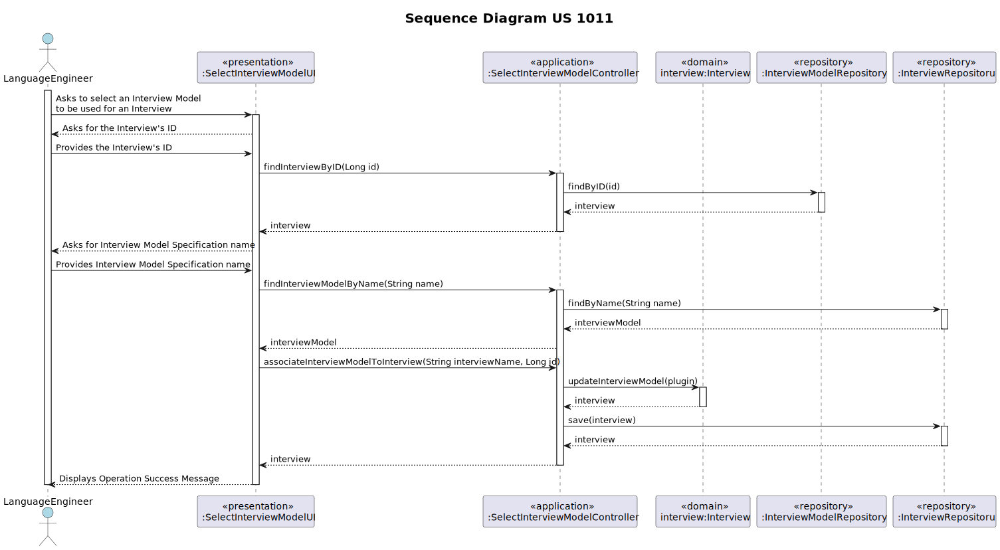

# US 1011 - As Customer Manager, I want to select the Interview Model to use for the interviews of a Job Opening (for their evaluation/grading).

## 1. Context

### 1.1. Customer Specifications and Clarifications

* Question 18: "Na US 1011 como é que o Customer Manager seleciona o modelo a usar para as entrevistas?"
    * Answer 18: "Admite-se que os modelos quando são registados no sistema (os tais “plugins”) ficam identificados com 
  um nome ou descrição. Por exemplo “Modelo de Entrevista para Operador de Caixa de Supermercado” ou “Modelo de Entrevista 
  para Programador Junior Backend Java”. Na US 1011 é suposto o Customer manager selecionar um modelo de uma possível 
  lista de modelos."

* Question 38: Cada questão de um interview model aceita um x tipos de respostas(ex escolha múltipla) ou é a interview 
model que aceita um x tipos de respostas em todas as suas questões? Assumimos que uma job opening só segue um interview 
model?
  * Answer 38: Sim, cada pergunta/resposta aceita um tipo de pergunta/resposta (um dos tipos que aparece no inicio da 
  página 8). Na US1011, o Customer manager seleciona o interview model a usar nas entrevistas para um job opening. Ou 
  seja, existirá apenas um interview model a usar nas entrevistas desse job opening.

* Question 41: "Como é que o Language Engineer faz o interview model e os job
  requirements? É texto? Ou ele seleciona perguntas para a interview e
  requirements para a job opening? E isso é quando se está a criar uma
  entrevista ou uma job opening ou para-se a meio para fazer isso e depois
  continua se?"
  * Answer 41: "O language enginner com informação passada pelo customer manager (que obteve
    do customer) vai desenvolver em java um jar correspondente ao modulo/plugin. Para esse
    desenvolvimento terá de utilizar técnicas de desenvolvimento de gramáticas/linguagens
    como o antlr. Esse código ficará num jar que depois o language engineer “instala/regista”
    na aplicação (US1008, por exemplo, associando um nome ao jar num ficheiro de
    configuração – “5 anos experiencia java”, “req-model-5-years-java.jar”). A aplicação com
    essa informação carrega dinamicamente esse jar. Na gramátca usada no jar é que vão
    estar espelhadas a estrutura das perguntas a usar nesse modelo e sua avaliação. Estas
    atividades têm de ser feitas antes de se poder fazer a US1008. Esse trabalho é feito “fora”
    dos sistema, apenas se registando o modelo (quando está pronto) na US1008. A US 1009 e
    US1011 permitem selecionar modelos a usar (dos que foram devidamente registados no
    sistema)."

* Question 88: US1002 – Quando o Customer Manager regista uma job offer, é ele que cria as requirement specifications e
  as interview models ou é-lhe dada uma lista destes para ele selecionar?
  * Answer 88: Existe a US1002 e as US1009 e US1011. Penso que está claro qual a responsabilidade de cada uma. A
    criação dos modelos das entrevistas e dos requisitos é um caso de uso especifico e com um US especifica para registar
    no sistema os respectivos plugins (US1008).

* Question 92: [1007, 1011] - Processo de Setup de uma Job Opening – Tendo em conta a US1007, de setup das diferentes 
fases do processo de recrutamento, gostaríamos que nos fosse esclarecido se, caso seja selecionada uma fase de Interview, 
é necessário haver uma ligação direta com a US1011, seleção de um interview model, ou serão funcionalidades separadas? 
Na eventualidade de serem separadas, passa então um recruitment process a ser válido apenas após a seleção de um interview 
model?
    * Answer 92: Suponho que a minha reposta seja similar à da pergunta anterior (Q91). Posso adiantar que podemos considerar 
  que a empresa para já pretende usar sempre um processo de avaliaçao de entrevistas “automático”, pelo que este deve estar 
  definido para se poderem “executar/processar” as entrevistas.

* Question 131: "Interview Questions- Pode nos esclarecer se as perguntas para a entrevista são as mesmas para todos os candidatos ou se tem uma pool
  de perguntas das quais são selecionadas de forma aleatória. Essas questões e as notas de cada são fornecidas pelo cliente?"
  * Answer 131: "As perguntas são as mesmas para todos os candidatos a um job opening (ver US 1011). As questões e as notas são definidas pelo Customer
    Manager em colaboração com o Customer. Por favor ver Q121."

## 1.2. Explanation

* It involves a new feature request to allow Customer Managers to select the Interview Model to be used for an Interview.
* This task has not been assigned or completed in previous sprints; it's a new addition to enhance the functionality of
  the system. There are no bugs related to this task; it's a new feature implementation.

## 2. Requirements

**US 1011** As Customer Manager, I want to select the Interview Model to use for the interviews of a job opening (for their evaluation/grading)

#### Use Cases:

* This user story will encompass use cases 1011 according to the data present in the Specifications Document.
  ([Specifications_Document.md](..%2F..%2FGeneral%20Documentation%2FUse%20Case%20Diagram%2FSpecifications_Document.md)).

#### Functionality:

* The task aims to enable Customer Managers to select the Interview model to be used for an Interview, by
  selecting a Interview Model from a list of available Interview Models, and then associating it with the Interview.

#### Understanding:

* As part of their responsibilities, Customer Managers need the capability to choose the appropriate Interview Model
for a given Interview. This will involve selecting from different sets of Interviews Models available within
the system. This selection will be crucial to ensure that only the most suitable candidates are considered for the job and
to guide the recruitment process effectively.

#### Dependencies:

1. **US 1002 - As Customer Manager, I want to register a Job Opening.**

This story depends on the existence of an Interview. Selecting the Interview for a Job Opening can only
occur if the interview is already registered in the system.

2. **US 1008 - As Language Engineer, I want to deploy and configure a plugin (i.e., Job Requirement Specification or
   Interview Model) to be used by the system.**

The presence of a configured plugin can directly influence the selection of Interview Model for a Job Opening.
If the Interview Model is a functionality enabled by the plugin, then story #1011 depends on its
implementation.

#### Acceptance Criteria:

- AC 1011.1: When selecting a interview plugin, it must be previously registered in the system by the Language Engineer.
- AC 1011.2: When selecting the interview, it should already be registered in the system by the Customer Manager.
- AC 1011.3: The selected interview should be associated with the chosen plugin, modifying the interview parameter of that job opening.

#### Input and Output Data

*Input Data:*

* Insert Data:
    * Name of the Interview Model
    * Job Reference of the Job Opening

*Output Data:*

* (In)Success of the operation

## 3. Analysis

* Use case 1011.1: Our Domain Model satisfies the requirements of the aforementioned use case, as when selecting a interview
  model for an interview, we will interact solely with the Interview aggregate and the plugin aggregate.
* See the Domain Model in: [domain_model_v4.puml](..%2F..%2FGeneral%20Documentation%2FDomain%20Model%2Fdomain_model_v4.puml)

## 4. Design 

### 4.1. Realization (Sequence Diagram) 

### 4.2. Class Diagram

For UC 1011, the decision to omit a separate class diagram from the documentation is based on the principles of Domain-Driven
Design (DDD). Duplicating class information from the domain model would introduce redundancy. By directly utilizing the
Domain Model, clarity and efficiency are maintained in the documentation process while ensuring alignment with the project's
evolving domain understanding. [domain_model_v4.puml](..%2F..%2FGeneral%20Documentation%2FDomain%20Model%2Fdomain_model_v4.puml)

### 4.3. Applied Patterns

#### Factory Pattern

The Factory pattern is employed in our system to facilitate the creation of repository instances, ensuring a flexible
and centralized approach to object creation. Here's why we utilize the Factory pattern:

1. The Factory pattern allows us to encapsulate the logic for creating complex objects, such as repositories, within
   dedicated factory classes.
2. By using a Factory, we abstract the process of object creation behind a common interface. This means that client code
   interacting with the factory doesn't need to know the specifics of how objects are created; it simply requests an object
   from the factory and receives the appropriate instance.
3. The Factory pattern offers flexibility in object creation by allowing different implementations of the factory to be
   used interchangeably. For example, we can have different factory implementations for in-memory storage and database-backed
   storage, and switch between them seamlessly based on our requirements.

#### DAO (Data Access Object) Pattern

The DAO (Data Access Object) pattern is used to encapsulate data access, providing an abstract interface to interact with
the database or any other data source. In our implementation, the DAO pattern can be identified in the CandidateRepository class.

1. The DAO pattern encapsulates data access operations such as saving, updating, retrieving, and deleting records. This
   allows database operations to be centralized in a single class, facilitating maintenance and reducing code duplication.
2. The DAO provides an abstract interface to interact with the data source, allowing the rest of the application to be
   independent of the specific database implementation.

#### Repository Pattern

We utilize the Repository pattern for managing candidate data because:

1. The pattern abstracts away the complexities of database interactions, allowing us to focus on business logic without
   directly dealing with database specifics.
2. The CandidateRepository interface provides a standardized way to perform Create, Read, Update and Delete operations on
   candidate entities. This uniform interface simplifies data access throughout the application.
3. Implementations like CandidateJpaRepository and InMemoryCandidateRepository handle specific data store interactions.

### 4.4. Tests 

Unit tests were deemed unnecessary as domain concepts had been thoroughly tested. Current operations involve manipulation
of existing domain instances, minimizing the need for additional testing.

## 5. Implementation 

### Main classes created

* `SelectInterviewModelController` - This class manages the process of associating an Interview Model with an Interview.
It provides methods to find specific Interview Models and Interviews, as well as to associate them. It handles exceptions during
the associating process.

* `SelectInterviewModelUI` - User Interface for selecting Interview Models for Interviews. Communicates with 
`SelectInterviewModelController` to perform the necessary operations.

## 6. Integration/Demonstration 

This functionality is integral to the operational workflow, allowing Customer Managers to efficiently align Interviews with specific Interview Models.

To execute this feature:

1. Execute the `build-all` and `run-bootstrap` scripts to initialize the system.
2. Launch `run-backoffice` and log in as an Language Engineer (e.g., Username: language1, Password: languageA1).
3. Access "4. Settings" and select "1. Deploy and configure a plugin (i.e., Job Requirement Specification or Interview Model) to be used by the system".
4. Select "1 - Register an Interview Model" and provide the necessary information.
5. Back out twice by pressing "0" twice.
6. Launch `run-backoffice` again and log in as a Customer Manager (e.g., Username: manager1, Password: managerA1).
7. Access "2. Settings" and select "2. Register a Job Opening". Fill in the required information.
8. Access "2. Settings" again and select "6. Select the Interview Model to be used for an Interview".
9. Provide the Interview ID and Interview Model name.
10. A success message confirms the successful Interview Model selection for the Interview.

## 7. Observations 

N/A
