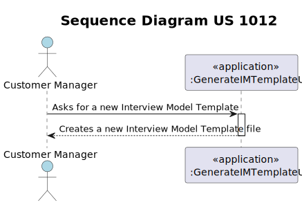

# US 1012 - As Customer Manager, I want to generate and export a template text file to help collect the candidate answers during the interviews.

## 1. Context

### 1.1. Customer Specifications and Clarifications

* Question 121: [US 1008] Perguntas para os plugins.- É possível esclarecer-nos se as perguntas a serem feitas para os 
Interview Models e os Requirement Especifications são aquelas que estão no exemplo da documentação ou tem algum grupo de 
questões que gostaria que nós utiliza-se-mos?
    * Answer 121: O documento de especificação apresenta, como disse, exemplos. São apenas exemplos indicativos. Podem 
  usar esses exemplos como casos de teste e como ponto de partida para definirem outros. Mas é suposto a solução suportar 
  mais do que apenas os exemplos que estão no documento. Em qualquer dos plugins, o tipo de perguntas que deve ser suportado
  é o que está apresentado na página 8 do documento. Como product onwer eu gostaria que uma demonstração funcional do 
  sistema incluísse pelo menos 2 plugins de cada tipo, para se poder demonstrar, minimamente, o suporte para mais do que 
  um plugin usado (de cada tipo) em simultâneo. Deve ainda demonstrar o uso de todos os tipos de perguntas apresentados na 
  página 8 (atualizado em 2024-04-27).

## 1.2. Explanation

* This user story entails a new feature request aimed at enabling Customer Managers to generate and export a template 
text file for collecting candidate answers during interviews.
* Unlike previous sprints, this task has not been assigned or completed yet; it represents a new addition intended to 
improve the system's functionality. There are no existing bugs associated with this task; it involves the implementation 
of a new feature.

## 2. Requirements

* US 1012 - As Customer Manager, I want to generate and export a template text file to help collect the candidate answers during the interviews.

#### Use Cases:

* This user story will encompass use cases 1012 according to the data present in the specifications document
  ([Specifications_Document.md](..%2F..%2FGeneral%20Documentation%2FUse%20Case%20Diagram%2FSpecifications_Document.md))).

#### Functionality:

* This user story entails implementing functionality that allows Customer Managers to generate and export a template text 
file specifically designed to assist in collecting candidate answers during interviews.

#### Understanding:

* Customer Managers require the ability to streamline the interview process by providing a structured template for collecting
candidate answers. This template text file should contain predefined fields or prompts tailored to gather relevant information 
from candidates during interviews. By having a standardized template, Customer Managers can ensure consistency in the data 
collected, facilitating the evaluation and comparison of candidate responses.

#### Dependencies:

1. **US 1011 - As Customer Manager, I want to select the interview model to use for the interviews of a job opening (for 
their evaluation/grading).** The ability to generate and export a template text file for collecting candidate answers 
during interviews is dependent on the availability and selection of the interview model. Without defining the interview model, 
it would be challenging to structure the template effectively for evaluating candidate responses.

2. **US 1008 - As Language Engineer, I want to deploy and configure a plugin (i.e., Job Requirement Specification or 
Interview Model) to be used by the system.** The successful implementation of the functionality to generate and export a template
text file relies on the deployment and configuration of the required plugin. If the plugin, such as the Interview Model, 
is not properly deployed and configured, the system may not have the necessary tools to support this feature effectively.

3. **US 2000a - As Operator, I want to register a candidate and create a corresponding user.** In order to generate and export
a template text file for collecting candidate answers during interviews, there must be candidates registered in the system. 
The process of registering candidates and creating corresponding user profiles is essential for facilitating the interview process.

4. **US 1002 - As Customer Manager, I want to register a job opening.** The functionality to generate and export a template 
text file for collecting candidate answers during interviews is closely tied to the existence of job openings. Before initiating 
the interview process and creating templates, job openings need to be registered in the system to provide context for candidate 
evaluation.

#### Acceptance Criteria:

* AC 1012: The system must allow Customer Managers to generate and export a template text file for collecting candidate answers.

#### Input and Output Data:

*Input Data:*

* Typed data:
  * N/A

*Output Data:*
  * Template text file containing predefined fields or prompts for collecting candidate answers during interviews.

## 3. Analysis

* Use case 1012: Our domain model satisfies the requirements of the aforementioned use case, as when generating a template text 
file for an interview, we will interact solely with the job opening aggregate and the Interview aggregate.
* See the domain model in: [domain_model_v4.puml](..%2F..%2FGeneral%20Documentation%2FDomain%20Model%2Fdomain_model_v4.puml)

## 4. Design

### 4.1. Realization (Sequence Diagram)

### 4.2. Class Diagram 

For UC 1012, the decision to omit a separate class diagram from the documentation is based on the principles of Domain-Driven
Design (DDD). Duplicating class information from the domain model would introduce redundancy. By directly utilizing the
domain model, clarity and efficiency are maintained in the documentation process while ensuring alignment with the project's
evolving domain understanding. [domain_model_v4.puml](..%2F..%2FGeneral%20Documentation%2FDomain%20Model%2Fdomain_model_v4.puml)

### 4.3. Applied Patterns 

N/A

### 4.4. Tests 

Unit tests were deemed unnecessary as domain concepts had been thoroughly tested. Current operations involve manipulation
of existing domain instances, minimizing the need for additional testing.

## 5. Implementation

### Main classes created

This code defines a class called GenerateIMTemplateUI within the PluginManagement package. It extends AbstractUI from the EAPLI framework.

In the doShow() method, it prints a message indicating the generation of an Interview Model Template and then calls the generateTemplate() method of the InterviewModel_EX1 class.

The headline() method returns a string "Generate Interview Model Template".

Overall, this class represents a user interface component responsible for generating an Interview Model Template.

## 6. Integration/Demonstration

1. Execute the `build-all` and `run-bootstrap` scripts to initialize the system.
2. Launch `run-backoffice` and log in as an Language Engineer (e.g., Username: manager1, Password: managerA1).
3. Access "2. Settings" and select "7. Generate a template text file for an interview model".

## 7. Observations 

Currently, as we possess only a single template for the interview model, this feature will streamline the process by
automatically generating the template. Instead of presenting a list of available interview model templates and prompting
the user to choose one, it simplifies the workflow by immediately creating the template.