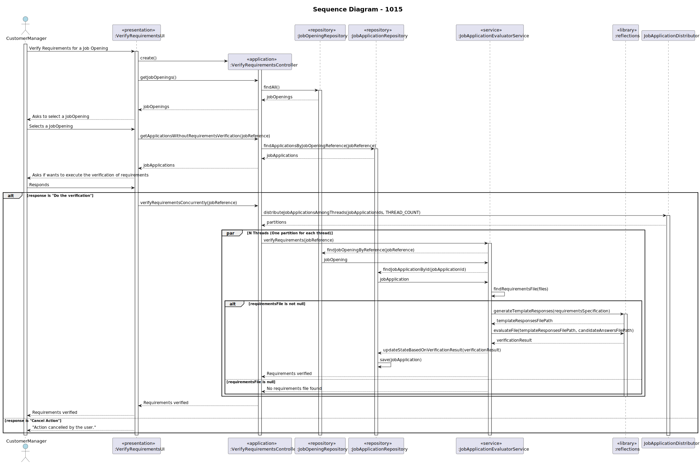

# US 1015 - As Customer Manager, I want to execute the process of verification of requirements of applications for a job opening.

## 1. Context
### 1.1. Customer Specifications and Clarifications

* Question 119: Management of screening data - We have a question about the management of the screen phase of the recruitment 
process. Specifically, after the applications are filtered during the screening process, I'm unsure about who manages the 
results and oversees this phase. Could you please clarify if the responsibility for managing the screening results falls 
under the customer manager, the operators, or both?
    * Answer 119: In US2003 and US2004 it is the Operator that “downloads” a template file to register the requirements,
  registers the answers for the requirements in the file, and then uploads the file. It is then the Costumer manager that 
  executes the verification process (US1015) and executes the notification of the results (US1016)

* Question 167: US1015 – Deve ser executado o processo para todos os candidatos ou apenas para alguns (segundo algum critério)?
  * Answer 167: Os ficheiros com as respostas aos requisitos vão entrando no sistema gradualmente. Talvez seja mais “simples”
  que o processo execute (ou seja, faça a verificação dos requisitos) para os candidatos para os quais já foi submetido o 
  ficheiro de requisitos. Nalgum momento o processo irá executar com todos os candidatos já com os ficheiros de requisitos 
  submetidos.

* Question 180: US2004 - Candidate Answers - Does US2004 only deals with the upload of the file to the system or also the 
registration of the candidate's answer by the Operator? I've seen many mentions about the file's answers but I want to understand
if that aspect is also part of US2004.
  * Answer 180: In US2003 the Operator downloads a template file that he/she uses to register the candidate requirements. In 
  US 2004, the Operator uploads a file with the requirements and the system should validate the file (verify of the syntax is 
  correct). US 1015 is the one that executes the verification of requirements for the candidates (based on the previously 
  uploaded files).

* Question 210: 1016 - Notify candidates - This user story has a functional dependency with 1015. I would like to know if 
an error occurs, do I need to delete what happened in US 1015, as if it were a transaction?
  * Answer 210: The process of notification (US1016) must be done after the verification (US1015) but an error in the notification
  does not invalidate the “results” of the verification process.

* Question 223: US 2004 – About the Us2004, in A180 you previously stated that "the Operator uploads a file with the requirements 
and the system should validate the file (verify of the syntax is correct). US 1015 is the one that executes the verification...". 
What should happen if the file failes this verification? Is the application instantly refused or do you have something else in mind?
  * Answer 223: A file that fails the verification means that that file has an error (syntactic error) it does not mean that the 
  application does not meet the requirements. The user should fix the error and submit again. Only US 1015 results in approving
  or rejecting an application.

## 1.2. Explanation 

The objective of this user story is to provide Customer Managers with the functionality to verify the requirements of applications 
for a job opening. This involves checking if candidates meet the specified criteria and qualifications for the position. The 
verification process will be supported by an initial automatic evaluation based on predefined requirements, allowing the 
Customer Manager to manually review and confirm the results.

## 2. Requirements

**US 1015** As Customer Manager, I want to execute the process of verification of requirements of applications for a job opening

#### Use Cases:

* This user story will encompass use cases 1015 according to the data present in the Specifications Document.
  ([Specifications_Document.md](..%2F..%2FGeneral%20Documentation%2FUse%20Case%20Diagram%2FSpecifications_Document.md)).

#### Functionality: 

* The task aims to enable Customer Managers to verify the requirements of applications for a job opening by starting with an 
initial automatic evaluation based on predefined criteria. This process involves:
  * Selecting a job opening to initiate the verification process.
  * Automatically evaluating each application against the job requirements.

#### Understanding: 

* The Customer Manager is responsible for finalizing the verification process, which involves starting with an automatic evaluation 
based on objective criteria.

#### Dependencies: 

1. **US 1002 - As Customer Manager, I want to register a job opening.**

   Registering a job opening is the first step in the hiring process, making it a fundamental dependency. Without a registered
   job opening, there is no context or framework within which to verify candidate requirements, rendering the verification process
   impossible.

2. **US 1008 - As Language Engineer, I want to deploy and configure a plugin (i.e., Job Requirement Specification or Interview Model) to be used by the system.**

   The deployment and configuration of the plugin are essential as it defines the requirements and models used in the job 
opening. Without the plugin, the requirements specification process cannot be completed, making it a prerequisite for executing 
the verification of requirements.

3. **US 1009 - As Customer Manager, I want to select the requirements specification to be used for a job opening.**

   Selecting the appropriate requirements specification for a job opening is crucial as it directly influences the criteria against
which candidates are evaluated. This user story must be completed to ensure that the requirements are accurately defined and can 
be verified during the application process.

4. **US 2003 - As Operator, I want to generate and export a template text file to help collect data fields for candidates of a job opening (so the data is used to verify the requirements of the job opening).**

   Generating and exporting a template text file ensures that the data collected from candidates is structured and complete, 
facilitating the verification process. This step is necessary to standardize the information needed to verify the requirements 
for a job opening.

5. **US 2002 - As Operator, I want to register an application of a candidate for a job opening and import all files received.**

  Registering a candidate's application and importing all related files are critical steps in the application process. This ensures
  that all candidate information and supporting documents are available for verification against the job requirements. Without this 
  step, the verification process cannot be performed accurately or comprehensively.

6. **US 2004 - As Operator, I want to upload a text file with the data fields (requirements) of a candidate for its verification.**

  The successful implementation of this user story is crucial for providing Operators with the capability to upload candidate data 
fields for verification. The system's ability to execute the process of verifying requirements for job applications (US 1015) relies
on the availability and accuracy of candidate data fields uploaded through US 2004.

#### Acceptance Criteria: 
    * The Customer Manager can select a job opening to initiate the verification process.
    * The system automatically evaluates each application against the job requirements.

#### Input and Output Data

+ The input for this operation is:  
        + The selection of a Job Opening from the provided list (in this case, the user selected "1" which corresponds to "ISEP-01").
        The confirmation to proceed with the verification (in this case, the user entered "y" to confirm).
+ The output of this operation is:
        * A list of candidates for the selected Job Opening.
        A message for each candidate indicating whether the requirements for the job opening were found or not. In this case, the message "No requirements found for job opening ISEP-01" is displayed for each candidate, indicating that no requirements were found for the selected job opening.

*Input Data:*

* Data :
    * selection of a Job Opening from the provided list
    * confirmation to proceed with the verification

*Output Data:*

* Data :
    * A list of job openings
    * A list of candidates for the selected Job Opening
    * (In)Success message of the operation

## 3. Analysis

* Use case 1015: Our domain model satisfies the requirements of the aforementioned use case, ensuring that Customer Managers
  can effectively execute the process of verification of requirements of applications for a job opening. 
* See the domain model in: [domain_model_v4.puml](..%2F..%2FGeneral%20Documentation%2FDomain%20Model%2Fdomain_model_v4.puml)

## 4. Design

The system uses a multi-threaded design to allow for concurrent processing of job applications. The `JobApplicationDistributor` class is used to distribute the job applications among the available threads. Each thread processes a job application independently using an instance of the `JobApplicationEvaluatorService` class.

### 4.1 Applied Patterns

#### Action/Command Pattern

Command is a behavioral design pattern that turns a request into a stand-alone object that contains all information about the request.
This transformation lets you pass requests as a method arguments, delay or queue a request’s execution, and support undoable operations.
E.g: SetupPhasesAction

#### Repository Pattern

We utilize the Repository pattern for managing candidate data because:

1. The pattern abstracts away the complexities of database interactions, allowing us to focus on business logic without
   directly dealing with database specifics.
2. The CandidateRepository interface provides a standardized way to perform Create, Read, Update and Delete operations on
   candidate entities. This uniform interface simplifies data access throughout the application.
3. Implementations like CandidateJpaRepository and InMemoryCandidateRepository handle specific data store interactions.

#### DAO (Data Access Object) Pattern

The DAO (Data Access Object) pattern is used to encapsulate data access, providing an abstract interface to interact with
the database or any other data source. In our implementation, the DAO pattern can be identified in the CandidateRepository class.

1. The DAO pattern encapsulates data access operations such as saving, updating, retrieving, and deleting records. This
   allows database operations to be centralized in a single class, facilitating maintenance and reducing code duplication.
2. The DAO provides an abstract interface to interact with the data source, allowing the rest of the application to be
   independent of the specific database implementation.

## 5. Implementation

The implementation involved using the `VerifyRequirementsController` class to start multiple threads for processing job applications. The `JobApplicationDistributor` class was created to handle the distribution of job applications among the threads.

## 6. Integration/Demonstration

The functionality was integrated into the existing system and tested to ensure that it works as expected. The tests involved verifying the requirements of multiple job applications concurrently and checking that the results are correct.

## 7. Observations

The multi-threaded design allows for efficient processing of job applications. However, care must be taken to ensure thread safety, particularly when accessing shared resources.
