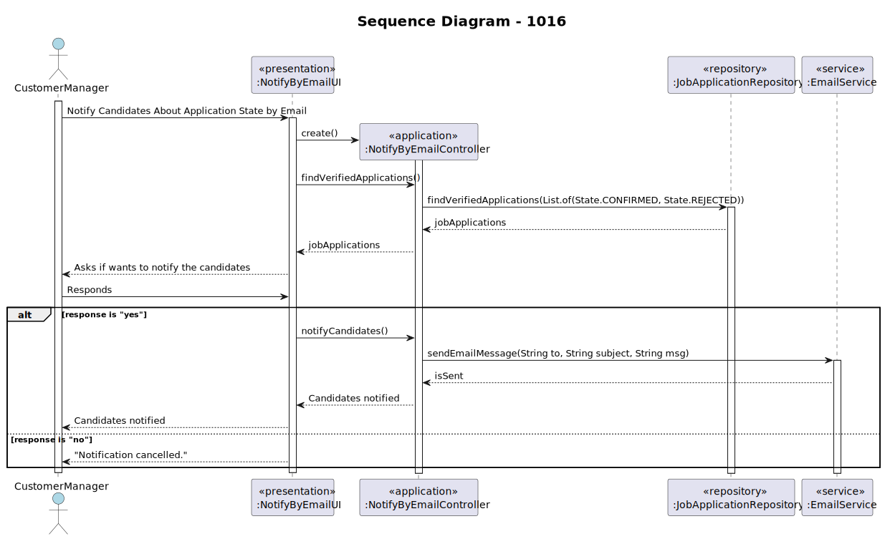

# US 1016 - As Customer Manager, I want the system to notify candidates, by email, of the result of the verification process

## 1. Context
### 1.1. Customer Specifications and Clarifications

* Question 48: US1016 e US1020, relativamente ao envio das notificações por email, é necessário guardar que esse envio foi feito?
  * Answer 48: No documento nada de explicito é dito sobre este assunto. No entanto, do ponto de vista de gestão do processo da jobs4u parece-me adequado que essa informação fique registada.

* Question 69: US1016 – Acerca da US 1016 - "As Customer Manager, I want the system to notify candidates, by email, of the result of the verification process" qual é o processo através do qual essa notificação é gerada? Após a avaliação do Requirement Specification module, este gera um resultado "Aprovado" ou "Rejeitado". Este resultado despoleta automaticamente uma notificação para o candidato ou é o Customer Manager que tem a responsabilidade de informar o candidato através do sistema do resultado da verificação (ex. depois de um resultado negativo ser gerado, o Customer Manager vai no sistema rejeitar o candidato para que seja enviado o email)?
  * Answer 69: É a segunda opção que apresenta. A US1015 permite que o Customer Manager invoque o processo de verificação de requisitos. Depois disso todas as candidaturas devem estar aceites ou recusadas. É então possível ao Customer Manager invocar a notificação através da US1016.

* Question 119: Management of screening data - We have a question about the management of the screen phase of the recruitment process. Specifically, after the applications are filtered during the screening process, I'm unsure about who manages the results and oversees this phase. Could you please clarify if the responsibility for managing the screening results falls under the customer manager, the operators, or both?
  * Answer 119: In US2003 and US2004 it is the Operator that “downloads” a template file to register the requirements, registers the answers for the requirements in the file, and then uploads the file. It is then the Costumer manager that executes the verification process (US1015) and executes the notification of the results (US1016)

* Question 164: US1016 - em relação a US1016 que diz o seguinte: "As Customer Manager, I want the system to notify candidates, by email, of the result of the verifcation process". Eu gostaria de saber qual o formato da mensagem a seguir para enviar ao cliente, poderia ser algo do genero: "Dear [Candidate's Name], I hope this email finds you well. As the Customer Manager, I wanted to inform you about the outcome of the verification process for the position you applied for. After careful consideration of your application and qualifications, I'm pleased to inform you that you have successfully passed the verification process. Congratulations! Your application has met our initial criteria, and we are impressed with your qualifications and experience. We will be proceeding to the next phase of the selection process, which may include interviews or additional assessments. We will reach out to you soon with further details regarding the next steps. Thank you for your interest in our company and for taking the time to apply for the position. We appreciate your patience throughout the process. If you have any questions or need further assistance, please don't hesitate to contact us. Best regards, [Your Name] Customer Manager [Your Company Name]" Gostaria de saber as informações mais importantes quando se notificar o candidato, deve aparecer o nome do customer manager, a job reference, o nome do candidato. E se o email deve ser em inglês ou português.
  * Answer 164: Pode ser como apresenta. Pode ser em português ou inglês.

* Question 209: US1016 - About the Us1016 wich states: "As Customer Manager, I want the system to notify candidates, by email, of the result of verification process". I want to know when the client says "verification process" is the same about the screening phase.
  * Answer 209: Yes.

* Question 210: Leite– 1016 - Notify candidates - This user story has a functional dependency with 1015. I would like to know if an error occurs, do I need to delete what happened in US 1015, as if it were a transaction?
  * Answer 210: The process of notification (US1016) must be done after the verification (US1015) but an error in the notification does not invalidate the “results” of the verification process.

## 1.2. Explanation

In this user story, the Customer Manager wants the system to notify candidates, by email, about the result of the verification process. The verification process is carried out by the Customer Manager and the results are then sent to the candidates via email.

## 2. Requirements

#### Use Cases:

TODO 

#### Functionality:

The system should be able to notify candidates, by email, about the result of the verification process.

#### Understanding:

The Customer Manager should be able to initiate the notification of candidates about the application state by email.

#### Dependencies:

This user story depends on US 1015, which is the verification process.

#### Acceptance Criteria:

1. The system should fetch all verified applications.
2. The system should ask the Customer Manager if they want to notify the candidates.
3. If the Customer Manager responds "yes", the system should notify the candidates.
4. If the Customer Manager responds "no", the action should be cancelled.

#### Input and Output Data

Input: Response from the Customer Manager ("yes" or "no").
Output: Email notification to the candidates.

## 3. Analysis

The analysis of this user story involved understanding the email notification process and implementing this process in the system.

## 4. Design

### 4.1. Realization (Sequence Diagram)

### 4.2. Class Diagram

The class diagram was updated to include the new classes and methods needed to implement email notification.

### 4.3. Applied Patterns

The patterns applied in this user story include the Controller pattern to manage the business logic and the Repository pattern to interact with the database.

### 4.2. Tests

Tests were written to verify the email notification functionality.

## 5. Implementation

### Main classes created

The main classes created for this user story include `NotifyByEmailUI`, `NotifyByEmailController` and `EmailService`.

## 6. Integration/Demonstration

The integration and demonstration of this user story involved running the system and verifying the email notification functionality.

## 7. Observations

No additional observations.