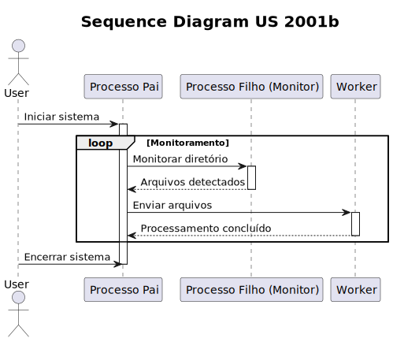
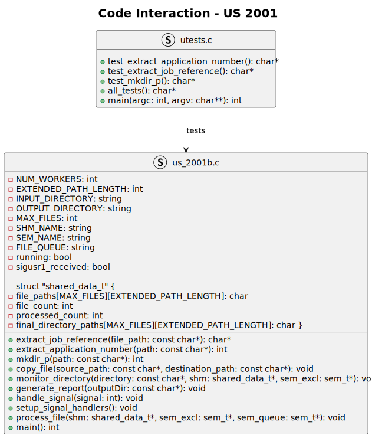

# SCOMP - US2001b

## Contribuição de cada elemento do grupo

- 1220688 Pedro Coelho : 25%
- 1220858 José Mendes : 25%
- 1221014 Diogo Moutinho : 25%
- 1221184 Luna Silva: 25%

## Funcionalidades Esperadas

1. **Processamento Contínuo de Arquivos:**
    - O sistema deve ser capaz de processar continuamente os arquivos produzidos pelo Bot de Email de Aplicações, permitindo sua importação no sistema mediante iniciativa do Operador.

2. **Desenvolvimento do "Applications File Bot":**
    - O "Applications File Bot" deve ser desenvolvido em C.
    - Deve utilizar processos, memória partilhada, semáforos e funções exec primitivas.
    - Um processo filho deve ser criado para monitorar periodicamente um diretório de entrada em busca de novos arquivos relacionados à fase de "Application" do processo de recrutamento.

3. **Distribuição de Arquivos entre Processos Filhos:**
    - Ao detectar novos arquivos, o processo filho deve enviar um sinal para o processo pai.
    - O processo pai deve distribuir os novos arquivos entre um número fixo de processos filhos trabalhadores.
    - Cada processo filho será responsável por copiar todos os arquivos relacionados a um candidato específico para seu subdiretório designado no diretório de saída.

4. **Geração de Relatório:**
    - Após copiar todos os arquivos para todos os candidatos, o processo pai deve gerar um arquivo de relatório no diretório de saída.
    - O relatório deve listar, para cada candidato, o nome do subdiretório de saída e os nomes de todos os arquivos que foram copiados.

5. **Terminação Controlada:**
    - Para encerrar a aplicação, o processo pai deve manipular o sinal SIGINT.
    - Ao receber o sinal, o processo pai deve encerrar todos os processos filhos e aguardar sua terminação.

6. **Configurabilidade:**
    - Os nomes dos diretórios de entrada e saída, o número de processos filhos trabalhadores, o intervalo de tempo para verificação periódica de novos arquivos, etc., devem ser configuráveis.
    - Essa configuração pode ser realizada por meio de parâmetros de entrada fornecidos ao executar a aplicação ou lendo de um arquivo de configuração.

7. **Testes:**
    - Testes unitários e de integração são altamente valorizados.


## Funcionalidades Implementadas

1. **Processamento Contínuo de Arquivos:**
    - 100% implementado.
   
2. **Desenvolvimento do "Applications File Bot":**
    - 100% implementado.

3. **Distribuição de Arquivos entre Processos Filhos:**
    - 100% implementado.
   
4. **Geração de Relatório:**
    - 100% implementado.

5. **Terminação Controlada:**
    - 100% implementado.

6. **Configurabilidade:**
    - 100% implementado.

7. **Testes:**
    - 100% implementado.

### Detalhes das funcionalidades não totalmente implementadas

- Nada a declarar.

## Diagrama de Sequência



## Interação entre o codigo do bot e o código dos testes unitários



## Testes (com recurso à framework MinUnit)

```
static char * test_extract_application_number() {
    printf("\nExtract application number test\n");
    char *path = "/home/josemendes/Desktop/us_2001b/files/1-candidate-data.txt";
    int expected = 1;
    int obtained = extract_application_number(path);

    if (obtained == expected) {
        printf("Success! Expected: %d, Obtained: %d\n", expected, obtained);
        return NULL; // Teste passou
    } else {
        printf("Failure! Expected: %d, Obtained: %d\n", expected, obtained);
        return "Test failed"; // Teste falhou
    }
}
````

```
static char *test_extract_job_reference() {
    printf("\nExtract job reference test\n");
    char *path = "/home/josemendes/Desktop/us_2001b/files/1-candidate-data.txt";
    char *expected = "IBM-000123";

    // Criar um arquivo e escrever o conteúdo esperado na primeira linha
    FILE *file = fopen(path, "w");
    if (file == NULL) {
        perror("Erro ao criar arquivo fictício");
        return "Test failed";
    }
    fprintf(file, "%s\n", expected); // Escrever o conteúdo esperado na primeira linha
    fclose(file);

    char *obtained = extract_job_reference(path);

    if (obtained == NULL) {
        printf("Failure! Obtained: NULL\n");
        return "Test failed"; // Teste falhou
    }

    if (strcmp(obtained, expected) == 0) {
        printf("Success! Expected: %s, Obtained: %s\n", expected, obtained);
        return NULL; // Teste passou
    } else {
        printf("Failure! Expected: %s, Obtained: %s\n", expected, obtained);
        return "Test failed"; // Teste falhou
    }
}
````

```
static char *test_mkdir_p() {
    printf("\nMkdir_p test\n");
    const char *test_path = "/tmp/test_directory/subdirectory";
    int result = mkdir_p(test_path);

    // Verificar se o diretório foi criado corretamente
    if (result == 0) {
        // Verificar se o diretório existe
        struct stat st;
        if (stat(test_path, &st) == 0 && S_ISDIR(st.st_mode)) {
            printf("Success! Directory %s created successfully.\n", test_path);
            // Remover o diretório criado após o teste
            rmdir(test_path);
            return NULL; // Teste passou
        } else {
            printf("Failure! Directory %s not created.\n", test_path);
            return "Test failed"; // Teste falhou
        }
    } else {
        printf("Failure! mkdir_p failed to create directory %s.\n", test_path);
        return "Test failed"; // Teste falhou
    }
}
````

## Outros aspetos importantes

- Existe a possibilidade de configurar o número de processos filhos trabalhadores, o intervalo de tempo para verificação periódica de novos arquivos e os diretórios de entrada e saída.
- Para correr quer o application file bot, quer os testes, basta correr o comando `make run` na pasta do projeto.
