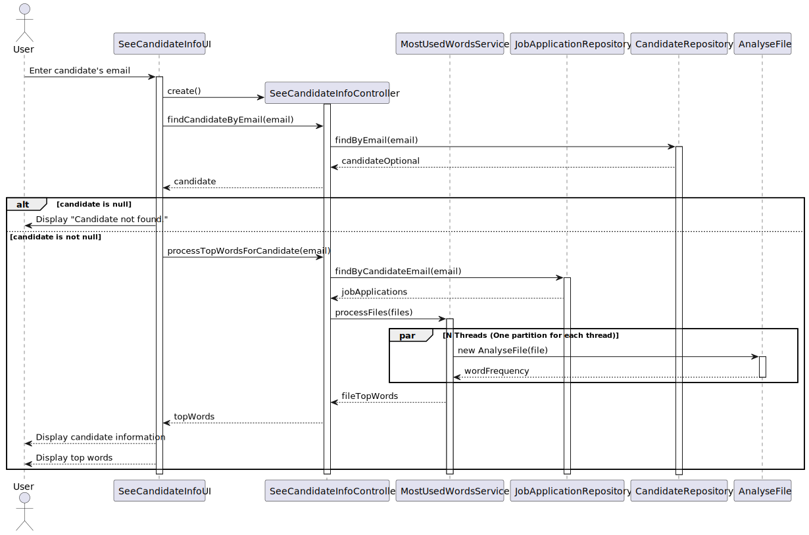

# US 4000 - As Customer Manager, when displaying the candidate data, I want the system to display a top 20 of the most referenced words in the files uploaded by a candidate and where they are in the document (ex: file and page or line). #48

## 1. Context
### 1.1. Customer Specifications and Clarifications

* Question 170: US4000 - Gostaria de saber se na US4000, relativa há criação da lista de palavras mais comuns, presentes nos ficheiros 
carregados pelo candidato, pretende escolher uma candidatura desse mesmo candidato e criar a respetiva lista, ou se pretende que 
esta lista seja criada, tendo em conta todas as candidaturas associadas a esse candidato
    * Answer 170: A lista de palavras é relativa a uma candidatura em particular.

* Question 181: US4000 - Files for word count evaluation - When making the Top 20 Used Words by a candidate, the files subject 
to word counting are all files of all the chosen candidate's applications? Or can the Customer Manager choose a candidate's 
specific application and from there get the top 20 words from those files?
    * Answer 181: See Q170.

* Question 185: US4000- The order of the list is important? Does it need to be ordered by the number of occurrences of the words?
  * Answer 185: Yes, the order is important. The system must present a top 20 list, from most referenced words to less referenced words.

* Question 186: US4000- For the word count, should all types of words be counted, or are there words that don't make sense to count, 
such as conjunctions?
  * Answer 186: For the moment there are no restrictions like the one you mention since they depend on the language used in the 
  text (the solution could/would be complex)

* Question 187: US4000- When displaying the candidate info is expected to show the list of words for each application of the candidate,
or the customer manager needs to select a specific application to see the list of words?
  * Answer 187: See Q170. This regards all the possible applications of a candidate that the customer manager is managing.

* Question 191: 4000 – Word Count – I think it makes sense to ignore words with less than 3 letters, or something like this, because 
it makes no sense to have words like as, I, am... Can we make this assumption or should we count any word?
  * Answer 191: See Q186. If you want, you may use a configuration file to configure the minimum number of sequence of characters 
  to be counted as a word in the process. However, this is a temporary exception, accepted, but not considered as a good solution 
  (a good solution should be one that takes into account the used language).

* Question 219: US 4000 - Duvida - Recentemente, respondeu a dúvidas sobre a funcionalidade que pretende que seja feita sobre o 
top 20 número de palavras em ficheiros de candidaturas de candidatos (Q170 e Q187). Quando analisamos as perguntas, ficámos 
na dúvida sobre qual a interpretação a levar em conta, de que a funcionalidade deve ser feita sobre todas as candidaturas do 
candidato (Q187), ou se o Customer Manager escolhe 1 candidatura do candidato e depois a funcionalidade faz o seu trabalho 
sobre apenas essa candidatura.(Q170)
  * Answer 219: Os dados do candidato (“candidate data”) referem-se aos dados do candidato que pode ter várias candidaturas. 
  Nesse contexto ao apresentar os dados de cada candidatura devem aparecer, para cada candidatura (application), o top 20.

* Question 220: US 4000 - Na us 4000 é referido, "Additionally, I require a comprehensive list of the files in which these 
words appear." Quer apenas que para a palavra "x" digamos em que ficheiros existe ou mais alguma informação?
  * Answer 220: É como indica, para cada palavra em que ficheiros aparece.

## 1.2. Explanation 

The goal is to develop a functionality that displays a top 20 list of the most referenced words in the files uploaded by a candidate, along with their locations in the documents, aiming to provide a detailed analysis of the language used by the candidates in their applications.

## 2. Requirements

**US 4000** As Customer Manager, when displaying the candidate data, I want the system to display a top 20 of the most referenced words in the files uploaded by a candidate and where they are in the document (ex: file and page or line).

#### Use Cases: 

* This user story will encompass use cases 4000 according to the data present in the Specifications Document.
  ([Specifications_Document.md](..%2F..%2FGeneral%20Documentation%2FUse%20Case%20Diagram%2FSpecifications_Document.md)).

#### Functionality: 

The functionality is to generate a top 20 list of the most commonly used words in files uploaded by a candidate, along with their respective locations in the documents, facilitating the analysis of candidate language usage across applications.

#### Understanding: 

The understanding is to implement a feature that generates a ranked list of the 20 most frequently used words in documents uploaded by a candidate, specifying their occurrences and locations within the files, thus enhancing the ability to analyze candidate submissions comprehensively.

#### Dependencies: 

1. **US 1002 - As Customer Manager, I want to register a job opening.**

Before registering a job opening, the Customer Manager must ensure that the system allows for job opening registration functionality

2. **US 2000a - As Operator, I want to register a candidate and create a corresponding user.**

Prior to registering a candidate and creating a corresponding user, the system must be capable of user and candidate registration functionality.

3. **US 2002 - As Operator, I want to register an application of a candidate for a job opening and import all files received.**

Before registering an application for a job opening and importing files received, the system needs to support candidate application registration and file import functionality

4. **1013 As Customer Manager, I want to rank the candidates for a job opening.**

Before ranking candidates for a job opening, the system must have functionality in place to register job openings and candidates.

#### Acceptance Criteria: 

- AC 4000.1: The system should provide a feature accessible to the Customer Manager to view a list of the top 20 most referenced words
- AC 4000.2: The list of words should be generated based on the content of files uploaded by the candidate
- AC 4000.3: Each word in the list should be accompanied by information indicating its location in the document (e.g., file name and page number or line number).
- AC 4000.4: The list should be ordered by the number of occurrences of each word, with the most frequently referenced words appearing at the top.

#### Output Data 

*Output Data:*
* (In)Success message of the operation

## 3. Analysis 

* Use case 4000: Our domain model satisfies the requirements of the aforementioned use case, ensuring that Customer Managers
  display the top 20 list of the most frequently referenced words from files uploaded by a candidate.
* See the domain model in: [domain_model_v4.puml](..%2F..%2FGeneral%20Documentation%2FDomain%20Model%2Fdomain_model_v4.puml)

## 4. Design

### 4.1. Realization (Sequence Diagram)

### 4.2. Class Diagram 

For UC 4000 the decision to omit a separate class diagram from the documentation is based on the principles of Domain-Driven
Design (DDD). Duplicating class information from the domain model would introduce redundancy. By directly utilizing the
domain model, clarity and efficiency are maintained in the documentation process while ensuring alignment with the project's
evolving domain understanding. [domain_model_v10.puml](..%2F..%2FGeneral%20Documentation%2FDomain%20Model%2Fdomain_model_v10.puml)

### 4.3. Applied Patterns 

* **Repository Pattern:** The CandidateRepository and JobApplicationRepository classes are used to abstract the data access 
logic. They provide methods to query and manipulate the data, hiding the details of the data access and storage.  

* **Service Pattern:** The MostUsedWordsService class encapsulates the business logic related to processing files and generating 
a list of the most frequently used words. This pattern is used to organize the business logic and keep it separate from the data 
access logic and the user interface.  

* **Controller Pattern:** The SeeCandidateInfoController class acts as an intermediary between the user interface and the 
business logic. It handles user input, interacts with the repositories and services to process the data, and updates the 
user interface.  

* **Builder Pattern:** The CandidateBuilder class is used to construct Candidate objects in a step-by-step manner. This pattern 
is used to handle the construction of complex objects.  

* **Thread Pool Pattern:** In the MostUsedWordsService class, multiple threads are used to analyze the files concurrently. 
This pattern is used to improve performance by distributing the workload among multiple threads.

### 4.2. Tests

MostUsedWordsServiceTest: This test class is responsible for testing the MostUsedWordsService class. 

## 5. Implementation

### Main classes created 

* **SeeCandidateInfoController:** This class is part of the application layer and is responsible for handling the user interactions 
related to viewing candidate information. It uses the CandidateRepository to fetch a candidate by their email and the JobApplicationRepository 
to fetch job applications associated with a candidate. It also uses the MostUsedWordsService to process the files associated 
with the job applications and generate a list of the most frequently used words. The class ensures that the user is authorized
to perform these actions by using the AuthorizationService. 

* **MostUsedWordsService:** This class is responsible for processing a list of files and generating a list of the most frequently 
used words in these files. It does this by distributing the files among multiple threads and then analyzing each file in a 
separate thread. The analysis is done by creating an instance of the AnalyseFile class for each file and running it. The results 
are then collected, sorted, and the top 20 words are selected.  

* **AnalyseFile:** This class implements the Runnable interface and is responsible for analyzing a single file. It reads 
the file line by line, splits each line into words, and counts the frequency of each word. The results are stored in a wordFrequency
map. The class is designed to be run in a separate thread, which allows multiple files to be analyzed concurrently.

## 6. Integration/Demonstration 

To execute this functionality, we need to run the scripts "build-all" and "run-bootstrap" (to load the actors responsible
for registering a candidate, in this case, the operators), and finally run "run-backoffice" to execute the user interface.
Next, we should log in with the credentials of a customer manager (e.g., manager1@this.app - username - managerA1 -
password) and then select the "settings" option and choose the option that says "Display all personal data of a candidate."
After this, simply input the email of the candidate whose personal information we want to check, and these details will
be printed alongside the most top 20 common words used in the candidate files.

## 7. Observations 
N/A